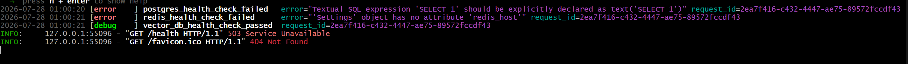
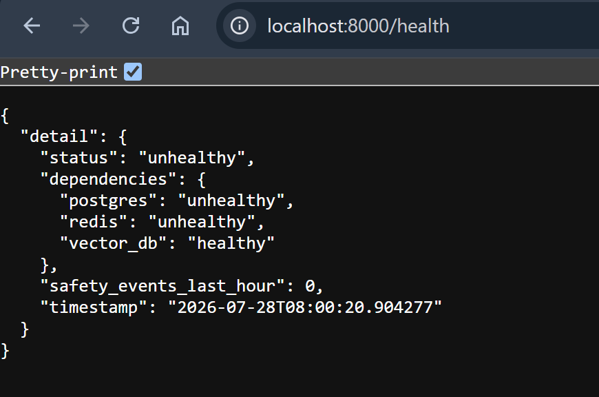

## Week 7 — Issue selection

**Issue link:** https://github.com/ascherj/pathreview/issues/154

**Issue title:** Health check DB probe passes a raw SQL string, which fails under SQLAlchemy 2.x

**Tier:** [ x] Tier 1  [ ] Tier 2  [ ] Tier 3

**Problem summary:**
In summary, the code check if the database is working using 'SELECT 1'. However, once it is upgraded to SQLAlchemy version 2.x, the testing query is now outdated. Consequently, the SQLAlchemy does not read the database, which causes the health check to fail, since it assumes that the database is faulty or is non-functional. In other to correct this issue, the SQL string has to be wrapped in a text format, text(), which then allows the health check to function properly. The required file for this project is located in api folder, under routes subfolder, `api/routes/health.py` and references `await db.execute("SELECT 1")`

**Branch name:** fix/154-healthcheck-SQL-string

**Setup confirmation:** [ x] App runs locally at localhost:5173

**Cohort ledger:** [ x] Issue added to cohort ledger

**"Is this right for me?" checklist**: Based on the checklist walkthrough, I have checked-off all four parts listed in the checklist. 
- In part I, I can explain the problem as noted above in the problem summary, located the relevant files and can describe the before and after the fix is implemented. 
- Part II: since this is my first attempt at contributing to open source, I chose issues that are in the tier 1 bracket.
- Part III: I have the code the issues references in the subfolder routes under the api folder, and I have a rough draft plan on how I intend to the issue. 
- Part IV: In terms of scope, I am fine with the number working on the same issue. I have a time estimate and I'm working on completing it by Week 9, and there no dependencies that needs to be solved before solving this issue. 

## Week 8 — Reproduction & solution planning

**Reproduction commit link:** https://github.com/nancyAfycodes/pathreview/blob/fix/154-healthCheck-SQL-string/api/routes/health.py

**Reproduction summary:** Once I verified SQLAlchemy version, I ran `make run` to start localhost:8000. Then I called the health check point `GET http://localhost:8000/health` and observed the response "503 Service Unavailable". The error is located in `api/routes/health.py`, line 32 as shown below, confirming that SQLAlchemy not longer accepts raw strings 
```python
await db.execute("SELECT 1")  # ❌ Fails in SQLAlchemy 2.x
```

**PLAN.md link:** https://github.com/nancyAfycodes/pathreview/blob/fix/154-healthCheck-SQL-string/PLAN.md

**Walkthrough video (recommended):** I have included screenshots instead



**Blockers or open questions:**
Since issue has other dependencies not directly related, how would fixing this particular issue help in solving related issues associated with SQLAlchemy in the repo?