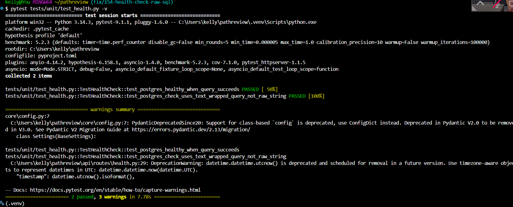

## Week 9 - Solution building & PR submission

### Check-in 1 (mid-week)

**Current progress:**
The fix for issue #154 was implemented in Week 7 (wrapping the raw SQL
string in `sqlalchemy.text()`), and this week I added test coverage for
it: `tests/unit/test_health.py`, with two tests - one confirming the
postgres check reports "healthy" when the query succeeds, and a regression
test confirming the query passed to `db.execute()` is a SQLAlchemy
`TextClause` rather than a raw string, guarding against the bug recurring.

I ran `make check` and `make test-unit` both before and after adding the
test file. Baseline: 178 lint errors, 53 failing unit tests (all in
unrelated modules - `safety/`, `ingestion/`, `rag/`, `agent/`,
`core/services/review_service.py`). After my changes: still 178 lint
errors and 53 failing tests, with 377 passing (up from 375) - confirming
no regressions were introduced.

**Next steps:**
Open a draft PR on GitHub, request peer/mentor feedback in Slack, and
write the PR description documenting the pre-existing failures per the
course's guidance on that scenario.

**Blockers:**
None currently.

---
---

### Check-in 2 (end of week)

**PR link:** https://github.com/ascherj/pathreview/pull/439

**Branch:** fix/154-health-check-raw-sql

**What I built:**
Fixed the `/health` endpoint's PostgreSQL probe, which was executing a raw
SQL string incompatible with SQLAlchemy 2.x. Wrapped the query in
`sqlalchemy.text()` so it executes correctly and the health check
accurately reports database status.

**Tests added or updated:**
Added `tests/unit/test_health.py` with two tests: one confirming the
postgres check reports "healthy" on success, and a regression test
confirming the query is passed as a SQLAlchemy TextClause rather than a
raw string.

<b>Output from my `make test-unit` command

**Self-review confirmation:** [x] make check passes  [x] make test-unit passes

**Draft PR feedback received from:** none yet