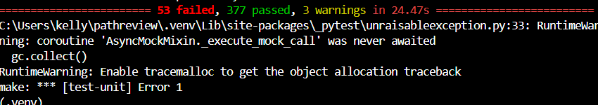

## Week 9 — Solution building & PR submission

### Check-in 1 (mid-week)

**Current progress:**
The fix for issue #154 was implemented in Week 7 (wrapping the raw SQL
string in `sqlalchemy.text()`), and this week I added test coverage for
it: `tests/unit/test_health.py`, with two tests — one confirming the
postgres check reports "healthy" when the query succeeds, and a regression
test confirming the query passed to `db.execute()` is a SQLAlchemy
`TextClause` rather than a raw string, guarding against the bug recurring.

I ran `make check` and `make test-unit` both before and after adding the
test file. Baseline: 178 lint errors, 53 failing unit tests (all in
unrelated modules — `safety/`, `ingestion/`, `rag/`, `agent/`,
`core/services/review_service.py`). After my changes: still 178 lint
errors and 53 failing tests, with 377 passing (up from 375) — confirming
no regressions were introduced.

**Next steps:**
Open a draft PR on GitHub, request peer/mentor feedback in Slack, and
write the PR description documenting the pre-existing failures per the
course's guidance on that scenario.

**Blockers:**
None currently.

---

### Check-in 2 (end of week)

**PR link:** https://github.com/ascherj/pathreview/pull/439

**Branch:** fix/154-health-check-raw-sql

**What I built:**
Fixed the `/health` endpoint's PostgreSQL probe, which was executing a raw
SQL string incompatible with SQLAlchemy 2.x. Wrapped the query in
`sqlalchemy.text()` so it executes correctly and the health check
accurately reports database status.

**Tests added or updated:**
Added `tests/unit/test_health.py` with two tests: one confirming the
postgres check reports "healthy" on success, and a regression test
confirming the query is passed as a SQLAlchemy TextClause rather than a
raw string.

Output from `make test-unit`:

**Self-review confirmation:** [x] make check passes  [x] make test-unit passes

**Draft PR feedback received from:** none yet

## Week 10 - Iteration & reflection
### Reviewer feedback

**Feedback received:** [ ] Yes  [x] No. Still awaiting review

**Summary of feedback:**
No reviewer feedback was available as I did not receive feedback on my PR Request.

**How you responded:**
N/A - no response was generated as no feedback was received.

### Reflection

**What was harder than you expected?**
Getting the environment running took way longer than I thought it would. I tried WSL through VS Code, then a virtual machine, and neither worked. What ended up saving me was a blog post someone shared in Slack. Even after that I kept running into the same Docker error over and over (connection refused on port 5433) because I didn't realize Docker Desktop had to actually be open and the containers started with docker `compose up -d` before `make run` would work. There were also a bunch of small errors  that took considerable time: running pytest with the system Python instead of the project's virtual environment, hitting port 5173 instead of 8000 more than once, and finding out later that my new tests weren't even being picked up by make test-unit because I forgot to add a pytest marker that wasn't mentioned anywhere in the docs. All in all it wasn't impossible, but it was difficult.

**What did you learn about working in a large codebase?**
The health check endpoint I fixed had a try/except that caught every exception and turned it into a generic "unhealthy" status. That meant the actual error never showed up in the API response, only in the server logs. I wouldn't have found the real bug without checking those logs. That was a good lesson: don't trust what the API is telling you on the surface, especially in code you didn't write. I also had to deal with a second, unrelated bug living in the same file (a missing redis_host setting), and I had to explicitly call that out in my PR so a reviewer wouldn't think my fix was incomplete just because the endpoint still returned a 503 overall. Finally, I think the most important lesson that I learned was to get a clear understanding of the structure of the codebase before touching the keyboard and writing a single line of code. It is important to understand the file structure of the codebase so that the area of issue can easily be identified and the fix can be easy to implement. So reading through the directory, reading through the files, skimming and simplifying out loud or in my mind what each file does in the codebase helps in the longrun. Additionally, implementing test files/unit tests are important especially for larger codebases. Automating testing saves a lot of time in that scenario.

**How did AI tools help, and where did they fall short?**
AI was helpful for quickly figuring out what error messages meant and for writing test code that matched the existing patterns in the codebase once it had enough context about how the project was structured. Where it fell short: some of its early guesses about my environment turned out to be wrong once I actually ran the commands, so I had to go back and forth based on real output instead of assumptions. Even though the code generated by AI oftentimes ran without errors initially, it was still important to review the implementation and stylistic approaches of the generated code. For instance, sometimes AI generates code that gives me the desired results but based on my background knowledge of the language there might be a simpler way or edge case not considered that if executed might break the AI generated code, so AI is a good assistant, but not the sole generator. An important lesson learned in previous weeks was to ensure that any code generated from AI matches the structure that already exists in the codebase that I am working on.

**What would you do differently if you started over?**
I would spend more time up front actually running the app and clicking through it before picking an issue, instead of going straight from the issue tracker to the code. I understood the health check bug fine on paper, but I didn't have a real feel for how the rest of the app worked, so I couldn't tell right away that the Redis check in the same file was a separate, unrelated bug rather than something connected to my fix. A little more exploration early on would have made that distinction obvious from the start instead of something I had to figure out mid-debugging. I would also ask upfront what testing convention the project expects, like the pytest marker I needed for my tests to actually get picked up, instead of finding out after a test run silently skipped my work.

**What are you most proud of from this module?**
Figuring out that my PR description probably wasn't being read correctly because of a formatting mistake in my JOURNAL.md, not because the content itself was insufficient. It would have been easy to just assume I wrote something wrong and leave it at that. Instead I looked closer and found an unclosed HTML tag and a broken image link sitting right before my PR link. Catching that felt like a real debugging win, separate from the actual code fix.