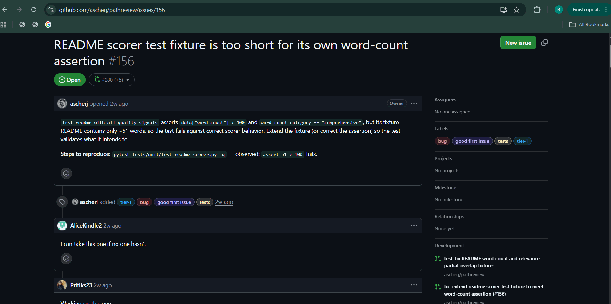

## Week 7 — Issue selection

**Issue link:** [https://github.com/ascherj/pathreview/issues/156]

**Issue title:** [README scorer test fixture is too short for its own word-count assertion #156]

**Tier:** [x] Tier 1  [ ] Tier 2  [ ] Tier 3

**Problem summary:**
The Issue basically is that the README Scorer Test Scorer Test is Failing due to the Fact that the Text Fixture only contained about ~51 Words, and that the Test expected it to have more than 100 Words to be counted as "comprehensive". The Scorer itself is not the Broken, it is just that the Test Data simply does not Matches the Test and such. A Successful Fix that would Accomplish would be to Extend the Fixture so that the Test can accurately Validates what it intended behavior of the README Scorer do and such.

**Branch name:** [fix/156-readme-scorer-fixture]

**Setup confirmation:** [x] App runs locally at localhost:5173

**Cohort ledger:** [x] Issue added to cohort ledger

---

## Week 8 — Reproduction & solution planning

**Issue Reproduction Documentation:**
After inputting [pytest tests/unit/test_readme_scorer.py -q] in the GitBash Terminal, it returns a Test Result that shows 22 Tests Passed and 1 Test Failed. The Failing Test, [test_readme_with_all_quality_signals], produced the Assertion Error: [assert 51 > 100], which shows the Issue is Reproducible by Confirming the Issue Described in GitHub Issue #156.

**Reproduction commit link:** [https://github.com/RaphaelDMCode/pathreview/commit/3ecb95c8ae4565ece97e88db49f10177ec107c39]

**Reproduction summary:** [1–2 sentences: How did you reproduce the issue? What did you observe?]

To Reproduce the Issue, I first use the Command [pytest tests/unit/test_readme_scorer.py -q] given in the GitHub Issue Comment, which will then show a Unit Test Fail with 22 Passed, and 1 Failed, with the [assert 51 > 100] Assertion Error. This type of Issue would be labeled as a Documentation Type of Issue, more specifically a Test Issue. The Issue is that the [ReadmeScorer] had correctly counted the [README] Text Fixture that contains only about ~51 Words. This shows that the Scoring Function/Logic itself is not the Problem, but the Unit Test’s Fixture where it fell short to Satisfy the Assertion being made.

**PLAN.md link:** [https://github.com/RaphaelDMCode/pathreview/blob/fix/156-readme-scorer-fixture/PLAN.md]

**Walkthrough video (recommended):** []

**Blockers or open questions:**
[Anything you're still uncertain about going into Week 9, or leave blank]
Currently None

---

## Week 9 — Solution building & PR submission

### Check-in 1 (mid-week)

**Current progress:**
[What have you implemented so far? Which sub-tasks from PLAN.md are done?]
Between extending the fixture or correcting the assertion, I decided to extend the README fixture. I first ran [make check] and [make test-unit] to establish a baseline of existing failures, so I could note that my implementation did not create any new failures. I then updated the fixture from 51 words to ~523 words while also preserving all the required quality signals, allowing the test to correctly validate the [ReadmeScorer] comprehensive category. I then run [pytest tests/unit/test_readme_scorer.py -q] to show that all 23 tests passed, and [make check] and [make test-unit] once again and show that my implementation did not create any new failures.

**Next steps:**
[What are you working on for the rest of the week?]
Creating my PR Description and Fixing Bits of my Content here and there.

**Blockers:**
[Anything slowing you down? Or leave blank.]

---

### Check-in 2 (end of week)

**PR link:** [https://github.com/ascherj/pathreview/pull/570]

**Branch:** [`fix/156-readme-scorer-fixture`]

**What you built:**
[1–3 sentences summarizing what your fix does and how it works]
The Fix I implemented fixed the Failing [test_readme_with_all_quality_signals] by extending the README Test Fixture from approximately around 51 words to around over 500 words (523 exact) while also perceiving all required quality signals it had and such. This is so that it allows the Fixture to reach the requirement of the [ReadmeScorer] “comprehensive” Category, so the existing Assertions now validate the Scorer’s intended behavior without modifying the Scoring Logic itself and such.

**Tests added or updated:**
[Which test files did you touch? What do they cover?]
- test_readme_scorer.py: The Test Fixture README Data
- PLAN.md: My Solution Plan - Implementation Fix

**Self-review confirmation:** [x] make check passes  [x] make test-unit passes

**Draft PR feedback received from:** [none]

---

## Week 10 — Iteration & reflection

### Reviewer feedback

**Feedback received:** [ ] Yes  [x] No — still awaiting review

**Summary of feedback:**
[What did reviewers comment on? Or note that no review came in.]
None. The Reviewer Feedback is not a Featue in this Summer 2026 AI201 Course.

**How you responded:**
[What changes did you make, or what did you reply? If no feedback,
leave blank.]
None. The Reviewer Feedback is not a Featue in this Summer 2026 AI201 Course.

---

### Reflection

**What was harder than you expected?**
[Be specific — what part of the process, codebase, or workflow
surprised you?]
I would say that setting up the Project was one of the Hardest Parts. I ran into several issues, such as getting the [make] commands to work, fixing up setup errors and such. Starting the Project can sometimes be overwhelming at first, with numerous files, folders and codebase and such. This taught me that preparing the development environment can sometimes be just as challenging as writing the code itself.

**What did you learn about working in a large codebase?**
[What's different about contributing to someone else's production code
vs. building your own project?]
I learned that working on a collaborative production codebase is vastly different from creating my own projects from scratch. There is much more to the development process than just simply staging changes and committing with random messages. I had to follow Branch naming conventions, write meaningful commit messages, work with the workflow, document my steps/planning, doing tests and runs, and submitting a Pull Request. This Project showed me how important understanding, documentation and following a team’s workflow are when contributing to software that other people also maintain and such.

**How did AI tools help — and where did they fall short?**
[Where was AI assistance most useful this module? Where did you need
to go beyond what AI could give you?]
AI tools helped me throughout this Project by explaining parts of the Project I did not fully understand, confirming my understanding of some parts of the project, answering my questions, and most of the time, helping improve my writing/sentences for documents and such. Despite AI’s help, I know that I couldn’t fully rely on AI again and again, so I did some steps of the project myself like understanding the issue, testing and running the error, finding where it went wrong and others.

**What would you do differently if you started over?**
[Issue selection, planning, implementation, or process — anything
you'd change?]
If I have started over, I would try and pick a more higher tier issue. Although this Tier 1 Issue helped me get an experience and knowledge of how the contribution workflow works, I still feel like I still know little and want to test my knowledge here and there, to see how I do well and see where I am currently at.

**What are you most proud of from this module?**
[One thing — it doesn't have to be the PR itself.]
I am most proud of experiencing what it feels like to contribute to a real collaborative software project. Following a professional workflow process, from reproducing the issue and planning the solution to implement the fix, testing and running it, and finally submitting a Pull Request.  This helped me experience what it feels like to work in a developed and maintained team environment.

---