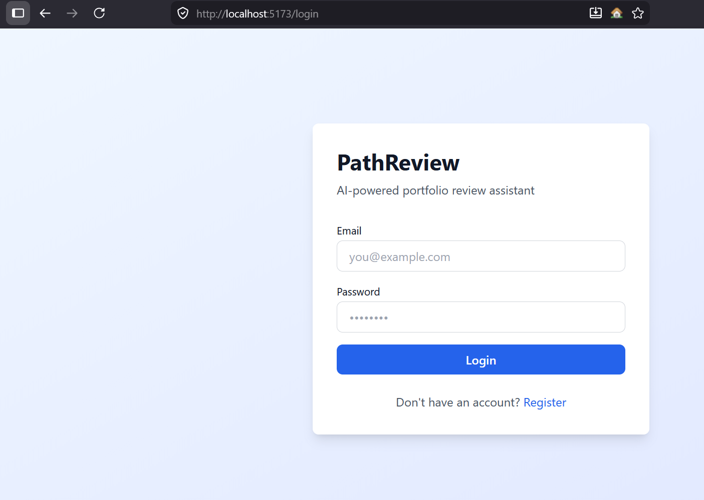

## Week 7 — Issue selection

**Issue link:** https://github.com/ascherj/pathreview/issues/149

**Issue title:** Structural chunker silently drops documents that contain no headings 

**Tier:**  Tier 1

**Problem summary:**
The issue is that the structural chunker returns an empty list when the document is missing a heading. The thing that is missing is a path to handle when a document doesn't have a header so that it can still be chunked. A successful fix would have another condition to extract text that doesn't rely upon headings to split the text. The problem is located in ingestion/chunking/structural_chunker.py

**Is this right for me** 
The structural chunker isn't properly chunking text without headers. 
The ingestion is what is being affected
The app should properly chunk text without a header.

This is my first open source contribution, and the issue is tier 1

I have found the relavent code
I understand the file well enough that I can change it.
I have read the relavent file test.

I am fine with how many other people are on this issue.
I am confident I can complete this before the week 9 deadline.
This issue has no blockers or dependencies.
**Branch name:** fix/149-structural-chunker-drops-documents

**Setup confirmation:**  App runs locally at localhost:5173

**Cohort ledger:** Issue added to cohort ledger

## Week 8 — Reproduction & solution planning

**Reproduction commit link:** https://github.com/RohanHaugen/pathreview/commit/1d103b98284cbde200ce769764e1fa9acd01b29b 

**Reproduction summary:**
The way I  reproduced the issue was by running the tests for structural chunker. I observed that it returned an empty list when the text was missing headings.
**PLAN.md link:** [PLAN.md](PLAN.md)

**Blockers or open questions:**

## Week 9 — Solution building & PR submission

### Check-in 1 (mid-week)

**Current progress:**
I have completed all tasks in PLAN.md.

**Next steps:**
I am going to focus on the edge cases to see if any have not been fulfilled.
**Blockers:**

### Check-in 2 (end of week)

**PR link:** [\[link to your submitted pull request\]](https://github.com/ascherj/pathreview/pull/511)

**Branch:** fix/149/structural-chunker-drops-documents

**What you built:**
My fix appends text before a heading to the text stack so that it isn't discarded. It also doesn't check that chunks have been submitted already before submitting everything else.
**Tests added or updated:**
I just touched the structural chunker test file, I added a test to see if the text before a heading is properly chunked, and the correction was in fixing the code so a test of a headingless document passed.
**Self-review confirmation:** [x] make check passes  [x] make test-unit passes

**Draft PR feedback received from:** "none"

## Week 10 — Iteration & reflection

### Reviewer feedback

**Feedback received:** [ ] Yes  [x] No — still awaiting review

**Summary of feedback:**
No review came in
**How you responded:**

---

### Reflection

**What was harder than you expected?**
The main thing that was harder than expected was testing the behavior, since it was not a user-visible feature. It was hard making a test case, but the provided tests did help.

**What did you learn about working in a large codebase?**
I learned about commit etiquette, as well as how important it is to create useful messages. 

**How did AI tools help — and where did they fall short?**
AI assistance was useful in reviewing my work once I had implemented a couple of solutions, as I hadn't noticed that I was still checking for a chunk when doing the final submission.

**What would you do differently if you started over?**
I think I would choose a harder issue, while the issue I chose was good, I think I could have challenged myself more.

**What are you most proud of from this module?**
The thing I am most proud about is how I learned over the course of it, as at first I made mistakes but over time I think I got better at creating commit messages and organizing my changes.