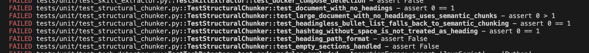

## Week 7 — Issue selection

**Issue link:** [\[paste link here\]](https://github.com/ascherj/pathreview/issues/149)

**Issue title:** Structural chunker silently drops documents that contain no headings

**Tier:** [X] Tier 1  [ ] Tier 2  [ ] Tier 3

**Problem summary:**
The structural chunker (structural_chunker.py) drops the entire document when headings are not present, meaning that the chunk method returns an empty list instead of using an alternate strategy to chunk the document, or chunking it as a single piece of text. This provides a horrible experience for users, who are not given any feedback as to why their document failed to produce any meaninful results. The relevant parts of the codebase would be ingestion/chunking/structural_chunker.py, tests/unit/test_structural_chunker.py, and perhaps one or more of the chunking files (or possibly even the parsing files) that support the structural parser. A fixed version of this bug would successfully chunk a document into meaningful chunks, even if no headings were present in the markdown file. 

**Branch name:** fix/149-structural-chunker-silently-drops-documents-with-no-headings

**Setup confirmation:** [X] App runs locally at localhost:5173


**Cohort ledger:** [X] Issue added to cohort ledger

**Is This Issue Right for Me? (checklist)**

Part 1 — Understanding the Issue

[X] I can explain the problem and the expected behavior in 2–3 sentences without reading the issue.
[X] I've located the relevant files and confirmed they exist in the codebase.
[X] I can describe a concrete before-and-after: what the user sees before the fix and what they see after.

Part 2 — Tier Fit

[X] If this is my first open source contribution: I'm choosing Tier 1.
[X] If I've contributed to large codebases before: Tier 2 or 3 is fair game.
[X] I'm not choosing a Tier 3 issue to "challenge myself" if I haven't completed a Tier 1 or 2 first — scope surprises in Week 9 don't have a safety net.


I am choosing Tier 1 because of limited time and resources. I think I could handle a Tier 2 issue, but I have put a lot of effort (and money on a GitHub Pro+ subscription), and I don't want to overextend myself.

Part 3 — Codebase Readiness

[X] I've found and read the specific code the issue references (not just the file — the function or section).
[X] I've read enough surrounding context that I can write a rough plan for the fix without looking anything up.
[?] I've found the test file for my module and read at least one test end-to-end. I only see unit tests. The integration test file is blank, so I'm not sure where the end-to-end test is. 
I tried to trace the flow through a route, but had difficulty determining where structural_chunker.py would be called. 

Part 4 — Scope and Time

[X] I've checked the issue comments and the ledger's Claims count, and I'm fine with how many others are on this issue. I got a late start on this, and chose an issue with one of the least number of other people working on it. 
[X] I've estimated the time this will take and I'm confident I can complete it before the Week 9 deadline.
[X] This issue has no open blockers or dependencies on other unresolved issues.

Step 5: Read the Tests Before You Read the Implementation

[X] What the function is supposed to do (its happy path)
[X] What edge cases it handles (each separate test case)
[X] What inputs it expects (the fixtures)
[X] What it returns (the assertions)

Step 6: Build a File Map (Write It Down)

**Where StructuralChunker.chunk() Is Reached**

- pipeline.py:27-53: IngestionPipeline initializes StrategySelector, embedding batch processing, and parsers.
- pipeline.py:126-143: ingest_readme() begins README ingestion and creates a README-specific source_id.
- pipeline.py:152-155: Checks whether this README source was already ingested and skips if so.
- pipeline.py:157-164: Parses the README with ReadmeParser.
- pipeline.py:166-173: Builds metadata and sets "source_type": "readme".
- pipeline.py:175-176: Calls self.strategy_selector.chunk(parse_result.text, metadata).
- strategy_selector.py:9-12: StrategySelector has both a SemanticChunker and StructuralChunker.
- strategy_selector.py:24-32: select_chunker() returns StructuralChunker only when source_type == "readme".
- strategy_selector.py:45-47: chunk() reads metadata["source_type"], selects the chunker, and calls chunker.chunk(text, metadata).
- structural_chunker.py:24-39: StructuralChunker.chunk() starts. It returns [] for empty text, otherwise calls _extract_sections(text).
- structural_chunker.py:41-48: Iterates through extracted markdown sections, builds a heading_path, gets section content, and counts tokens.
- structural_chunker.py:49-57: If a section is over SECTION_TOKEN_LIMIT, it copies metadata, adds heading metadata, and delegates to SemanticChunker.
- structural_chunker.py:58-68: If the section fits, it creates one Chunk with heading metadata, chunk index, and character bounds.
- structural_chunker.py:70: Returns the final chunk list.
- structural_chunker.py:72-122: _extract_sections() splits markdown by headings, tracks heading hierarchy with a stack, saves each section with content, path, and level, then returns those sections.
- In short: route → process_review() → placeholder _run_ingestion_pipeline() today, but the intended README chunking path is IngestionPipeline.ingest_readme() → StrategySelector.chunk() → StructuralChunker.chunk().


Right now, from POST /reviews, pipeline.py is not reached.
The actual route is: reviews.py:36-43 calls create_review(...), then schedules process_review(...) as a background task.
review_service.py:127-128 runs:

•	ingestion_results = await _run_ingestion_pipeline(db, profile)

•	POST /reviews
•	  -> create_review_endpoint()
•	  -> create_review()
•	  -> background_tasks.add_task(process_review, ...)
•	  -> process_review()
•	  -> _run_ingestion_pipeline() in core/services/review_service.py

pipeline.py is only reached if some code explicitly instantiates IngestionPipeline and calls one of its methods, such as:
•	pipeline = IngestionPipeline(vector_db, db_session, embedding_provider)
•	pipeline.ingest_readme(profile_id, repo_name, readme_content)


**AI Help**

There were a mess of errors between linting, formatting, and broken tests. I tried running the commands, but was unable to fix the linting errors: none of the --fix suffixes it suggested worked, and documentation on the Internet was limited without the explicit understanding that pyproject.toml was enforcing the rules. This should have been made clear to us students.

I had to bring in Claude to help me. 

**Claude Output**

- Result: the commit gate (ruff + black + mypy) passes ✅
- What actually blocked you
- Formatting was a red herring. The real blocker was mypy — your just-installed pre-commit hook enforces types across a codebase that was never fully annotated, producing 532 errors.

- What I changed (your chosen "relax config" approach + minimal safe code)
- Config — pyproject.toml, matching how this codebase was actually written:

- disallow_untyped_defs = false — cleared ~500 missing-annotation errors
- warn_return_any = false — cleared 4 no-any-return (SQLAlchemy/redis return Any)
- implicit_optional = true — cleared 4 implicit-Optional errors
- Small, behavior-neutral code fixes for the ~20 baseline errors config can't silence:
- var-annotated annotations on empty collections — semantic_chunker.py, structural_chunker.py, skill_extractor.py, two test files
- dict[str, Any] / list[dict[str, Any]] annotations — health.py, market_analyzer.py

**type: ignore[attr-defined] on the known Alembic false positive — env.py**
- A latent bug fix: repo_analyzer.py:27 — parse() was annotated str | bytes but its body and docstring handle dict. I widened it to str | bytes | dict to match reality (no behavior change).
- Verified, stated plainly
- Tests: my edits caused zero regressions. The suite has 54 pre-existing failures (this repo has ~130 known seeded bugs). I proved the one test that looked suspicious (test_heading_path_format) fails with my annotation reverted too — so it's not mine. Note two of those failures are your #149 target (test_document_with_no_headings, test_heading_path_format), still red because #149 isn't fixed yet.

**Important**
The config relaxation is a team-wide gate change. It's reversible, and I kept check_untyped_defs = true so mypy still checks inside functions. Worth a heads-up to your team / a note in the PR.

## Week 8: Steps to Reproduce


**Reproduction commit link:**   https://github.com/ascherj/pathreview/commit/ee553d5571663dcd5bf2101651dcf463e66d9b92


**Reproduction summary:**  Issue #149 on [GitHub](https://github.com/ascherj/pathreview/issues/149) tells you how to reproduce the issue. I simply followed the steps to produce the expected output, shown in the first screen shot below. 

```
StructuralChunker.chunk() returns an empty list for any document without markdown headings, so the entire document is silently excluded from the RAG index instead of being chunked as a single block or falling back to another strategy.

### Reproducing the Issue Locally:

from ingestion.chunking.structural_chunker import StructuralChunker
c = StructuralChunker()
print(len(c.chunk('This is a plain document with no headings at all. ' * 20, {})))
# observed: 0  (a ~1000-char document produces no chunks)

```


You can also observe that the unit test for this piece of code is failing. 


**PLAN.md link:** https://github.com/mardisworld/pathreview/blob/fix/149-structural-chunker-silently-drops-documents-with-no-headings/PLAN.md

## Week 9 — Solution building & PR submission

### Check-in 1 (mid-week)

**Current progress:**

#### Implementing the Plan

**Important: I switched order of PLAN.md steps in order to implement Test Driven Development (TDD). 


3. Strengthen test_document_with_no_headings() in test_structural_chunker.py to verify that:

    - At least one Chunk is returned.
    - The returned text contains the original document content.
    - Incoming metadata is preserved.
    - No heading_path or heading_level metadata is invented.
    
I also had AI write tests for all edge cases it had identified in PLAN.md first. They failed, of course, because the fix(es) had not yet been implemented.



1.  Reproduce the no-heading failure with the existing focused test:

****Reproducing the Issue Locally:**

```

from ingestion.chunking.structural_chunker import StructuralChunker
c = StructuralChunker()
print(len(c.chunk('This is a plain document with no headings at all. ' * 20, {})))
observed: 0  (a ~1000-char document produces no chunks)

```


2. Update StructuralChunker.chunk() in structural_chunker.py to check whether _extract_sections(text) returned no sections. When the input is non-empty but contains no Markdown headings, delegate to the existing self.semantic_chunker.chunk(text, metadata) fallback.

The fix worked for the intended headingless-text tests, but the full module still has three unrelated failures: exact newline preservation for semantic bullet-list chunks, heading-path assertion ordering, and an empty structural-section chunk.


To fix these failing tests, I had to trace each failure to its owning behavior: semantic text normalization for the list, the misplaced test assertion, and structural extraction emitting an empty section. The failures have three local causes: the semantic splitter trims away newline delimiters, two heading-path tests assert too early inside their loops, and _extract_sections() saves whitespace-only content between consecutive headings. 

The semantic tests impose no normalization contract, so preserving delimiters is compatible and fixes the list regression at the source. I retained split-boundary whitespace and concatenated semantic segments, skipped whitespace-only structural sections, and moved both heading-path assertions after their loops.

I fixed all three reported failures:
- Semantic chunks now preserve original whitespace and newlines, so headingless bullet lists retain their exact text.
- Empty structural sections are skipped instead of producing empty chunks.
- The heading-path test assertions now run after all chunks are inspected.

4. Add a test for a long headingless document. Verify that semantic fallback returns non-empty chunks and that concatenated chunk content still represents the input, allowing for intentional overlap behavior.

I strengthened the existing test test_large_document_with_no_headings_uses_semantic_chunks so that instead of having 100 identical sentences, it generated 100 unique sentences. 

5. Run the focused structural-chunker test module and formatting/linting checks required by the repository:


**Next steps:**
I will work on Check-in 2 and submit it by Monday. 

**Blockers:**
N/A

---

### Check-in 2 (end of week)

**PR link:** [\[link to your submitted pull request\]](https://github.com/ascherj/pathreview/pull/722)

**Branch:** [fix/149-structural-chunker-silently-drops-documents-with-no-headings](https://github.com/mardisworld/pathreview/tree/fix/149-structural-chunker-silently-drops-documents-with-no-headings)

**What you built:**
I fixed the branch so that it would fall back to semantic-chunker.py if there were no headings found in the document. I also created several test cases around the edge cases that AI documented in my PLAN.md document. 

**Tests added or updated:**
File test_structural_chunker.py:
    Fixed/Hardened: test_document_with_no_headings
    Added: test_large_document_with_no_headings_uses_semantic_chunks
    Added: test_headingless_bullet_list_falls_back_to_semantic_chunking
    Added: test_hashtag_without_space_is_not_treated_as_heading

**Self-review confirmation:** [x] make check passes  [x] make test-unit passes

## Week 10 — Iteration & reflection

### Reviewer feedback

**Feedback received:** [ ] Yes  [x] No — still awaiting review

**Summary of feedback:**
No review came in. 

**How you responded:**
No feedback came in, but I was confident that my pull request would have been approved. 

---

### Reflection

**What was harder than you expected?**
The codebase was much deeper and more complex than what I am used to working with. I am a Software Engineer at Liberty Mutual, and I thought work applications were complex, but this was even more complex to me. Perhaps that is because I am less familiar with production Pyton code (I've only used Python in school projects), or perhaps it was because it used different aspects of AI development that I haven't seen combined in one project before. It also was probably because I didn't **have** to understand the entire codebase to implement my small fix, so I didn't take the time to fully understand the details of it. The API layer (Authentication, validation, rate limiting), Ingestion Pipeline (Parse documents, chunk, embed, store), Agent Orchestrator (Plan analysis, execute tools, manage state),  RAG System (Retrieve context, generate feedback, evaluate),  Safety Layer (Bias check, content filter, PII scrub), and Review Output was a lot to evaluate and understand at once. 

**What did you learn about working in a large codebase?**
Following coding standards that are implemented by a team - making sure that every commit followed the structure outlined by CONTRIBUTING.md was not new, but it was actually stricter than what I have to follow at work. Git rebasing is new to me, and I got a C on that assignment (Assignmenent #6), while all of my other assignments I got an A or A+. Taking the time to fully understand the codebase would habe been beneficial, but I think I was (am) kind of burned out after this course.

**How did AI tools help — and where did they fall short?**
AI helped most in the planning of the fixes in structural_chunker.py that needed to be implemented. It was also helpful wiht generating the tests in test_structural_chunker.py that covered the edge cases that were identified in PLAN.md, then implementing the fix(es) to make sure that the issue was completely resolved before submission. 

**What would you do differently if you started over?**
If I hadn't worked so hard on the earlier projects - and I did put a LOT of effort into some of them, especially Projects 1 and 3 (25 - 30 hours per project) and as I said earlier, this burned me out to some extent. I probably would have chosen a more difficult issue if I had more bandwidth and energy, but I wanted to do an easy project that I knew wouldn't eat up all of my free time during these last few weeks. This project didn't challenge me, and it isn't like me to choose the easy path. I think I just need to learn to pace myself, and not let myself get burned out half way into a course. That said, it was a good learning experience.  

**What are you most proud of from this module?**
I am most proud of the test cases that were created based on the edge cases identified in PLAN.md. 

