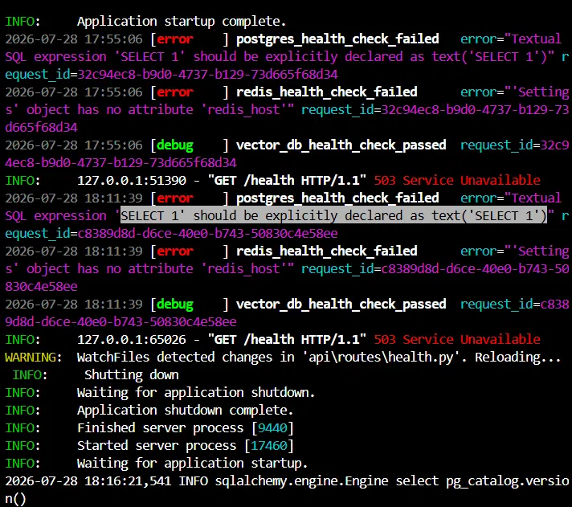

## Week 7 — Issue selection

**Issue link:** https://github.com/ascherj/pathreview/issues/34

**Issue title:** Implement a re-ranking step that uses an LLM to score retrieved chunks before generation

**Tier:** [ ] Tier 1  [ ] Tier 2  [x] Tier 3

**Problem summary:**
Right now, PathReview's retriever ranks chunks using only vector similarity and keyword overlap scores. This means the final context sent to the generator may include chunks that match on surface keywords but aren't actually relevant to the user's query. The fix is to add an optional re-ranking pass that calls a smaller LLM to score each chunk's relevance before the top-k are handed to the generator. This lives in the rag/retriever module, primarily in a new reranker.py file and integration with hybrid.py. A successful implementation would improve answer quality by filtering out false-positive retrievals.

**Issue selection reasoning (Is this right for me?):**
I can explain the issue without looking at it: the retriever currently ranks chunks by vector and keyword scores alone, but that misses relevance nuance that only an LLM can catch. The fix adds an optional reranker step before generation. I found the relevant files (rag/retriever/hybrid.py exists, reranker.py is new) and read the retriever logic enough to sketch a plan. I checked the test directory and found existing retriever tests I can mirror. I chose Tier 3 because I have prior, though minimal, experience with RAG pipelines and LLM APIs, and the scope is contained to one new module plus one integration point. The 7-10 hour estimate fits within the two-week implementation window given my schedule. No blockers or dependencies on other issues.

**Branch name:** feat/34-setup-&-short-description

**Branch link:** https://github.com/Modeste01/pathreview/tree/feat/34-setup-%26-short-description

**Setup confirmation:** [x] App runs locally at localhost:5173

**Cohort ledger:** [x] Issue added to cohort ledger

## Week 8 — Reproduction & solution planning

**Reproduction commit link:** https://github.com/Modeste01/pathreview/commit/80c9bfa

**Reproduction summary:**
Two-part reproduction. First, a structural test confirms the reranker module does not exist: importing `ChunkReranker` from `rag.retriever.reranker` raises ImportError, and `HybridRetriever.__init__` has no `reranker` parameter. Second, a behavioral test simulates what happens without a reranker: given a query like "What frontend frameworks does this candidate use?", the retriever returns chunks scored by keyword overlap alone. A chunk about "Flask REST API framework" (backend, not frontend) scores higher than a chunk about Vue.js because it has a stronger keyword match on "framework." Without an LLM to judge actual relevance, these false positives stay in the top results and get passed to the generator as context.

**PLAN.md link:** https://github.com/Modeste01/pathreview/blob/feat/34-setup-%26-short-description/PLAN.md

**Walkthrough video (recommended):** https://youtu.be/pZt-e1viPQE

**Blockers or open questions:**
Need to decide which LLM to use for reranking (GPT-3.5-turbo is cheap and fast, but a local model would avoid API costs in tests). Also need to confirm whether batching all chunks in one prompt or scoring them individually gives more reliable results.

## Week 9 — Solution building & PR submission

### Check-in 1 (mid-week)

**Current progress:**
Completed sub-tasks 1 and 2 from PLAN.md. Created `rag/retriever/reranker.py` with the `ChunkReranker` class that scores chunks in batches using an LLM, handles fallbacks on API errors or malformed responses, and filters by a configurable relevance threshold. Integrated it into `hybrid.py` as an optional `reranker` parameter so existing behavior is unchanged when no reranker is passed. Updated `rag/retriever/__init__.py` to export the new classes. Rewrote the test file with 9 unit tests covering normal reranking, top-k limits, API failures, malformed JSON, and the integration with HybridRetriever both with and without a reranker.

**Next steps:**
Sub-task 3: define the scoring prompt template (mostly done, lives in reranker.py already but may refine wording). Sub-task 5: add environment variable config to enable/disable reranking and set the model. Then open the PR and fill in Check-in 2.

**Blockers:**
None right now. Went with batched scoring (all chunks in one prompt) which resolved the earlier open question.
