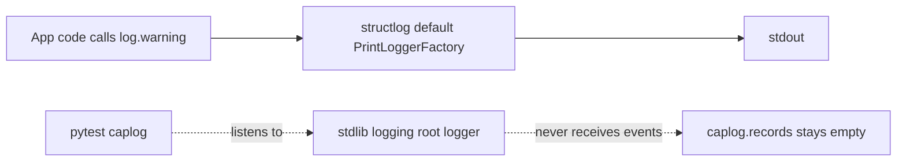

## Solution plan

**Issue:** #159 — structlog output is not captured by pytest caplog (log assertions fail suite-wide)

### Understand
Expected: log events emitted via structlog (e.g. the "Empty chunks list" warning in `batch_processor.py`) should be visible to pytest's `caplog` fixture, since `caplog` attaches a handler to the stdlib root logger.

Actual: structlog is never configured in the test environment — `configure_logging()` in `core/logging.py`, which wires structlog into stdlib logging via `structlog.stdlib.LoggerFactory()`, is defined but never called anywhere in the codebase (not in tests, not even at app startup in `api/main.py`). Without it, structlog falls back to its default `PrintLoggerFactory`, which writes directly to stdout and never touches stdlib logging — so `caplog` sees nothing, even though the log call happened correctly.

### Log flow — before the fix

### Log flow — after the fix

### Map
- `core/logging.py` — contains `configure_logging()`, the function that sets up structlog's processor chain and routes it through stdlib logging. This is the function that needs to be invoked.
- `tests/conftest.py` — currently has no logging-related fixtures at all; this is where the fix will likely live (a fixture that calls `configure_logging()` before each test, or once per session).
- `api/main.py` — the app entry point; confirmed via grep that it never calls `configure_logging()` either, so this file may also need a one-line addition if we decide to fix the app-wide issue, not just the test issue.
- `tests/unit/test_batch_processor.py` — the test we used to reproduce the bug; will serve as the verification test once the fix is in.

### Plan
1. Add a pytest fixture in `tests/conftest.py` (likely `autouse=True`, session or function scoped) that calls `configure_logging()` before tests run, so structlog routes through `structlog.stdlib.LoggerFactory()`.
2. Run `test_empty_chunks_list_returns_empty` again to confirm `caplog.text` now contains the expected message, and that the assertion passes.
3. Run the full test suite (`make test-all`) to check whether other tests relying on log assertions are also fixed, and whether anything regresses (e.g. tests that assumed silent/plain stdout output).
4. Decide and document whether to also call `configure_logging()` in `api/main.py` at startup, since it's currently dead code there too — even though it's outside the strict scope of #159.
5. Update `JOURNAL.md` with the fix summary once verified.

### Inputs & outputs
Input: no new external inputs — the fix changes when/how `configure_logging()` runs, not any function signature. Test files remain unchanged in how they call `caplog`.
Output: after the fix, structlog log calls made during tests will produce stdlib `LogRecord` objects that populate `caplog.records` and `caplog.text`, matching what tests already expect.

### Risks & unknowns
- `tests/conftest.py` fixture scope matters: if scoped too broadly (e.g. `session`), `cache_logger_on_first_use=True` in `core/logging.py` could cause stale logger config across tests — need to verify this doesn't cause cross-test leakage.
- Calling `configure_logging()` also runs `logging.basicConfig(...)`, which sets the stdout stream and log level globally — could affect test output verbosity or interfere with pytest's own log capture setup if run more than once.
- Unclear whether other tests (outside `test_batch_processor.py`) implicitly depended on the *current* broken behavior (e.g. asserting stdout output directly instead of using `caplog`) — running the full suite in step 3 of the Plan should surface this.
- If we also fix `api/main.py` (Plan step 4), that changes production log formatting (JSON vs console) for the first time in the running app — worth flagging as a behavior change beyond just fixing tests.

### Edge cases
- A test that runs with `caplog.set_level(...)` set to a level stricter than `settings.log_level` — need to confirm the fixture doesn't silently swallow records below that threshold.
- Tests that check for the *absence* of log output (e.g. asserting no warnings were logged) — must still pass once logging is actually wired up, not just tests expecting a positive match.
- Multiple tests running in the same session with `cache_logger_on_first_use=True` — confirm a logger configured in one test doesn't carry stale state into the next.
- Tests that already inspect stdout directly (e.g. via `capsys`) instead of `caplog` — confirm they still pass once output also starts flowing through stdlib logging (could result in duplicate output if both stdout print and logging handler are active).

### Outcome
Implemented steps 1–3 and 5 as planned. Step 4 (wiring `configure_logging()` into `api/main.py`) was deliberately deferred — flagged as a follow-up issue in the PR's "Notes for Reviewers" rather than bundled into this fix, to keep the PR scoped to the test-capture bug in #159.
