# PathReview

**AI-powered portfolio review assistant** that helps early-career developers strengthen their professional portfolios.

PathReview analyzes GitHub profiles, resumes, and project repositories to generate structured, actionable feedback on portfolio completeness, project quality, skill gaps, and presentation improvements.

## Features

- **Profile Ingestion** — Upload a resume (PDF or Markdown), connect a GitHub profile, and link project repositories
- **RAG-Powered Feedback** — Retrieval-augmented generation produces specific, evidence-based feedback referencing your actual work
- **Multi-Tool Agent** — An AI agent orchestrates GitHub analysis, skill extraction, README scoring, and market comparison
- **Safety Guardrails** — Bias detection, content filtering, PII scrubbing, and prompt injection defense ensure feedback is constructive and safe
- **Web Dashboard** — View results, track improvement over time, and export shareable review summaries

## Quick Start

> **Windows users:** Use [Git Bash](https://git-scm.com/download/win) to run these commands, not PowerShell. See [docs/SETUP.md](docs/SETUP.md) for Windows-specific setup including installing `make`.

```bash
# Clone and enter the repo
git clone https://github.com/ascherj/pathreview.git
cd pathreview

# Configure environment (add your OPENROUTER_API_KEY to .env)
cp .env.example .env

# Start backing services — must be running before make setup
docker compose up -d

# Run first-time setup (installs deps, runs migrations, seeds DB, installs frontend)
make setup

# Start the application
make run
```

Then open http://localhost:5173 in your browser.

For detailed setup instructions including platform-specific notes, see [docs/SETUP.md](docs/SETUP.md).

### Environment Setup: Step Zero

Before choosing an issue or writing code, confirm your baseline:

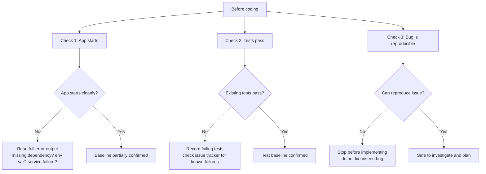

## Architecture

PathReview is structured as a multi-service Python + React application with five major subsystems:

| Subsystem | Directory | Description |
|---|---|---|
| API Layer | `api/` | FastAPI REST API with authentication, validation, and rate limiting |
| Ingestion Pipeline | `ingestion/` | Document parsing, chunking, and embedding generation |
| RAG System | `rag/` | Hybrid retrieval, LLM-based review generation, and quality evaluation |
| Agent System | `agent/` | Multi-tool orchestration with planning, state management, and error handling |
| Safety Layer | `safety/` | Content filtering, bias detection, PII scrubbing, and prompt defense |
| Frontend | `frontend/` | React + TypeScript dashboard with Vite |

For a detailed architecture overview, see [docs/ARCHITECTURE.md](docs/ARCHITECTURE.md).

### System Overview

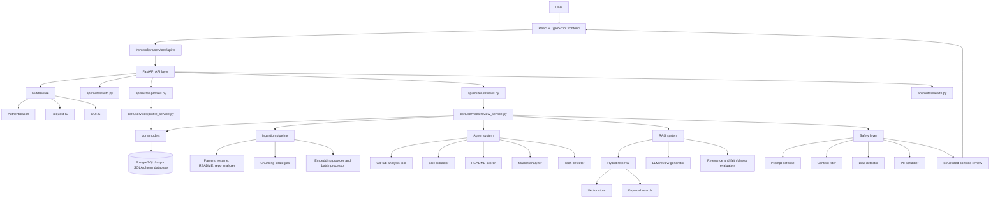

### Frontend Routes and Navigation

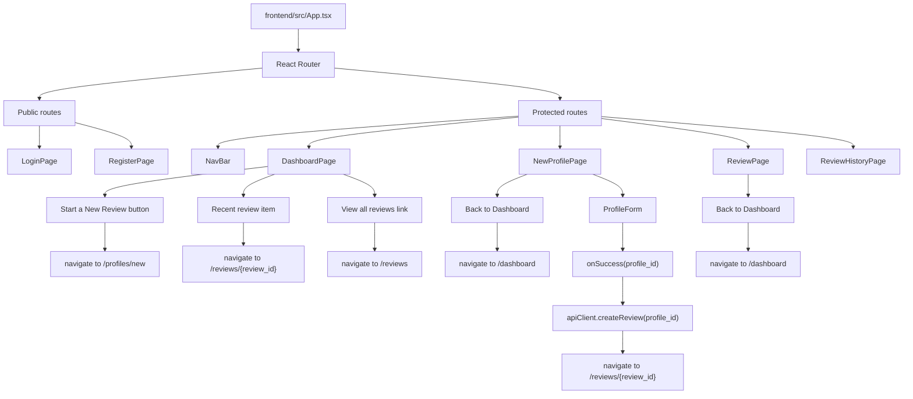

### Frontend API Client Map

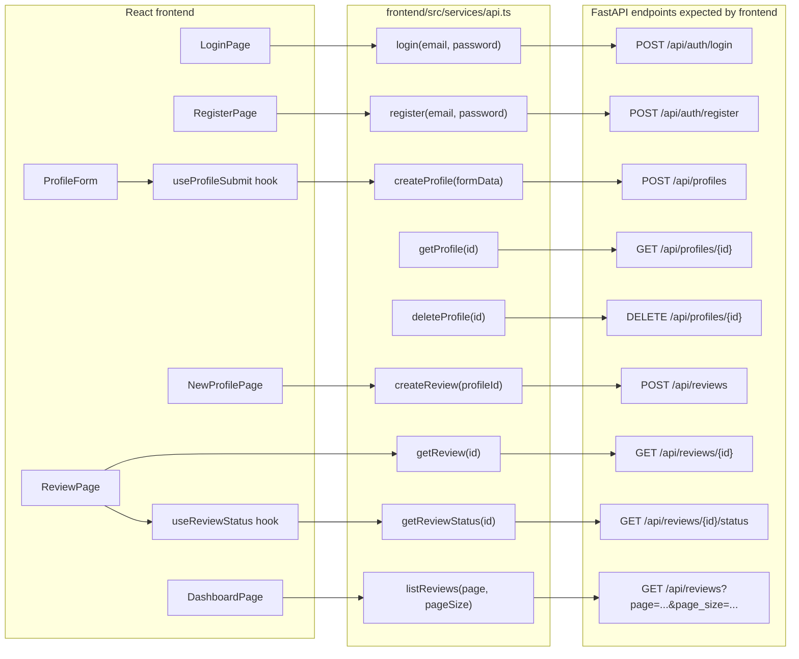

### Frontend to FastAPI Request Flow

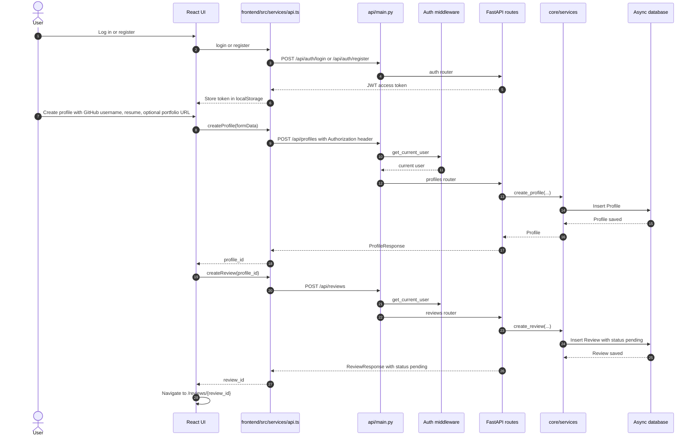

### Profile Creation Flow

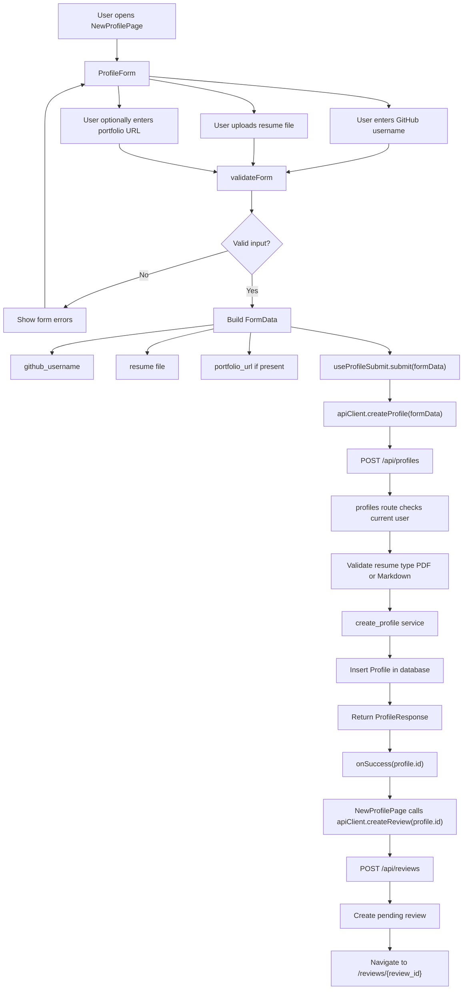

### Async Review Processing Pipeline

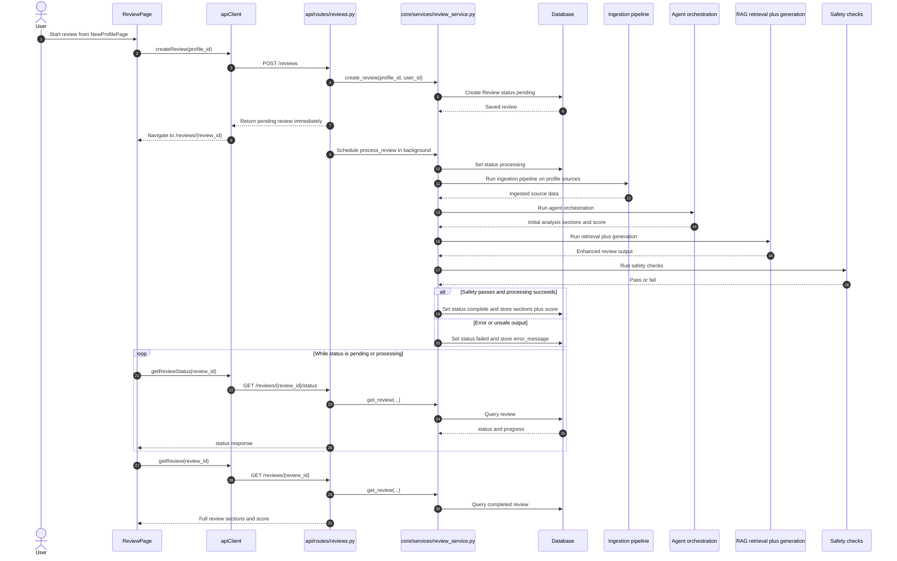

## Issue Selection (AI201 Module 3)

Module 3 spans four phases across Weeks 7–10:

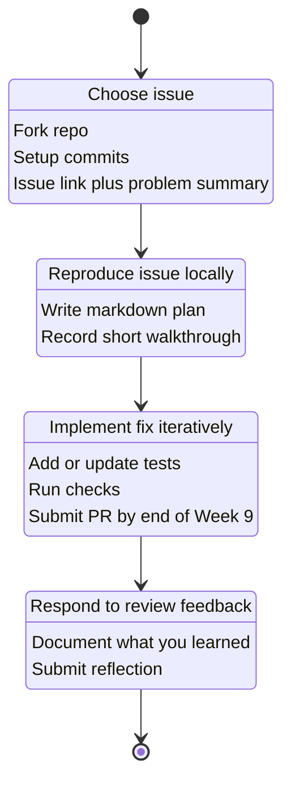

### Week 7 Contribution Workflow

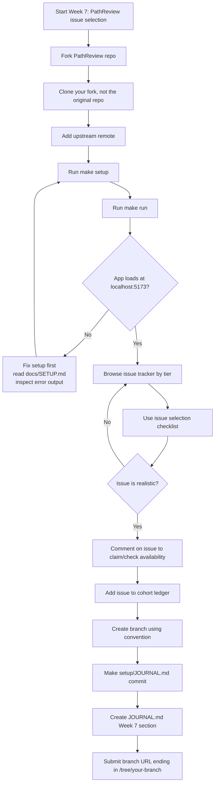

### Five Questions Before You Commit

Screen candidates quickly — five questions, five minutes:

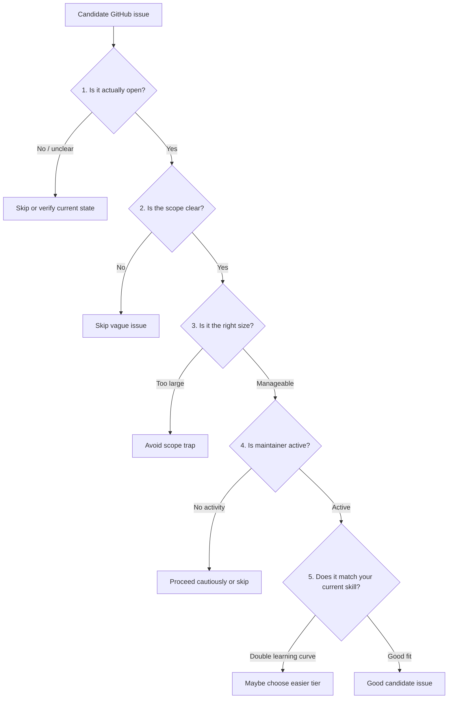

### Reading the Issue Thread

The description is only part of the story — look for these signals:

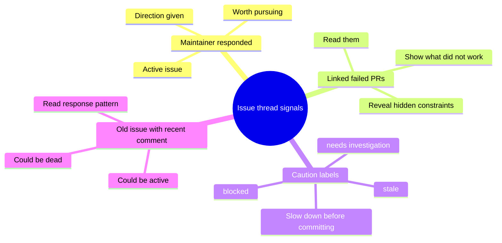

### Issue Selection and Contribution Workflow

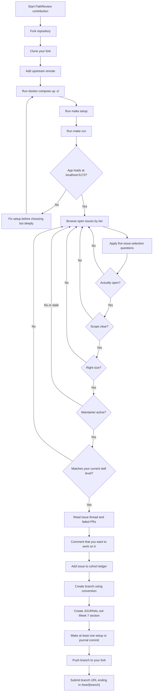

### Routing by Issue Label

Use the issue label to narrow where to start in the codebase:

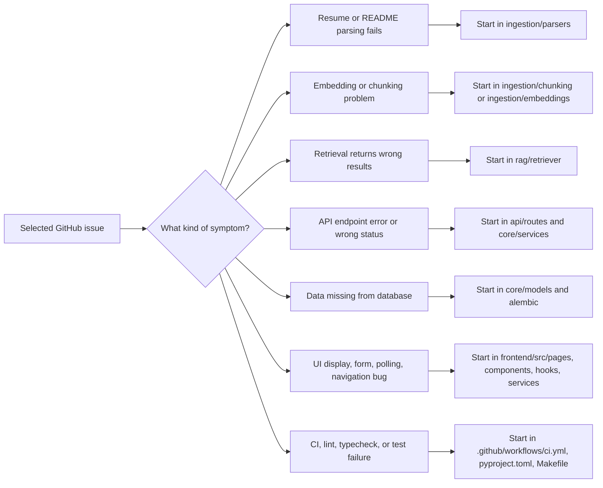

### Solution Plan Structure

A solution plan is a living document — especially the known-unknowns section:

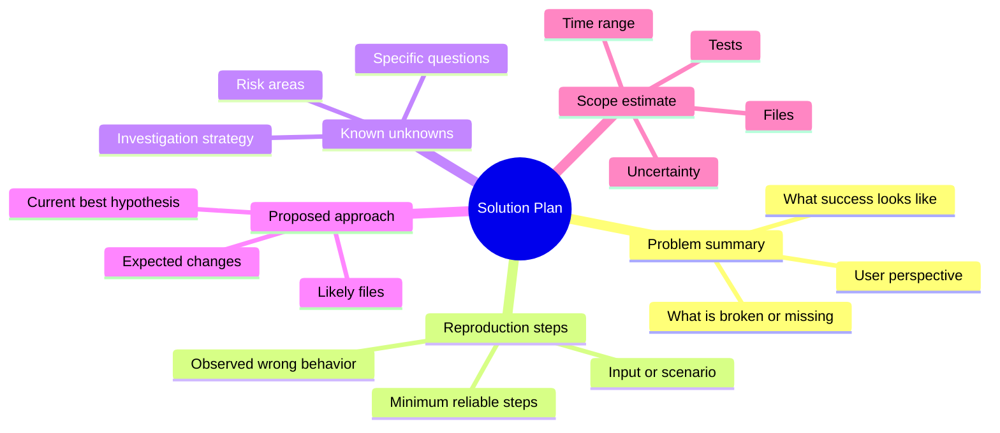

## Contributing

We welcome contributions! Please read [docs/CONTRIBUTING.md](docs/CONTRIBUTING.md) before submitting a pull request.

## Development

```bash
make help          # Show all available commands
make test-unit     # Run unit tests (~30 seconds)
make check         # Run linter + formatter + type checker
make run           # Start the dev servers
```

### Test and CI Coverage

```mermaid
flowchart TD
    Tests["PathReview test and CI coverage"]
    Tests --> CI[".github/workflows/ci.yml"]
    CI --> Lint["lint job"]
    CI --> Typecheck["typecheck job"]
    CI --> Unit["test-unit job"]
    CI --> Integration["test-integration job"]
    CI --> FrontendCI["frontend job"]
    Lint --> Ruff["ruff check"]
    Lint --> Black["black --check"]
    Typecheck --> Mypy["mypy api core ingestion rag agent safety"]
    Unit --> PytestUnit["pytest tests/unit"]
    Unit --> MockLLM["LLM_PROVIDER=mock"]
    Integration --> Postgres["PostgreSQL service"]
    Integration --> Redis["Redis service"]
    Integration --> PytestIntegration["pytest tests/integration"]
    FrontendCI --> NpmCI["cd frontend && npm ci"]
    FrontendCI --> NpmTest["cd frontend && npm test -- --run"]
    Tests --> BackendReviewTests["tests/unit/test_review_service.py"]
    BackendReviewTests --> CreateReviewTests["create_review tests"]
    BackendReviewTests --> GetReviewTests["get_review ownership/query tests"]
    BackendReviewTests --> ListReviewsTests["list_reviews pagination/count/order tests"]
    Tests --> SharedFixtures["tests/conftest.py"]
    SharedFixtures --> ResumeFixture["sample_resume_text"]
    SharedFixtures --> ReadmeFixture["sample_readme_text"]
    Tests --> FrontendTestFiles["Frontend component tests from repo file list"]
    FrontendTestFiles --> ProfileFormTest["ProfileForm.test.tsx"]
    FrontendTestFiles --> ReviewSectionTest["ReviewSection.test.tsx"]
    Tests --> OtherUnitAreas["Additional unit tests from repo file list"]
    OtherUnitAreas --> IngestionTests["resume/readme parsers, chunkers, embeddings"]
    OtherUnitAreas --> RagTests["retrieval, generation parsing, relevance, faithfulness"]
    OtherUnitAreas --> SafetyTests["PII, bias, prompt defense, rate limiting"]
    OtherUnitAreas --> AgentToolTests["readme scorer, skill extractor, tech detector"]
```

## License

MIT
