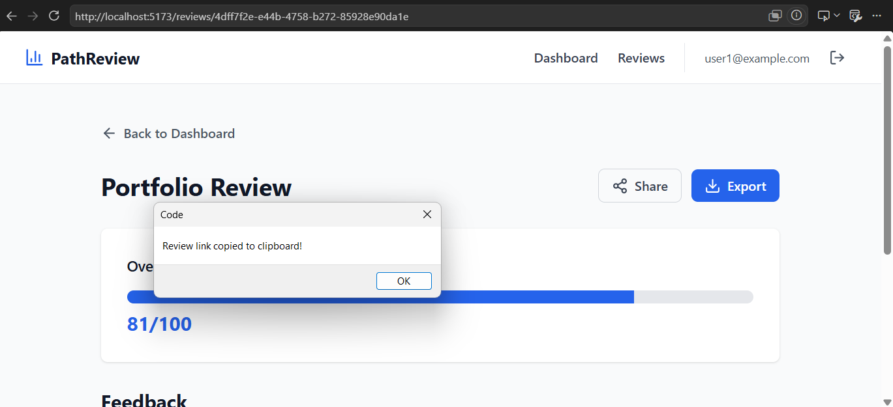
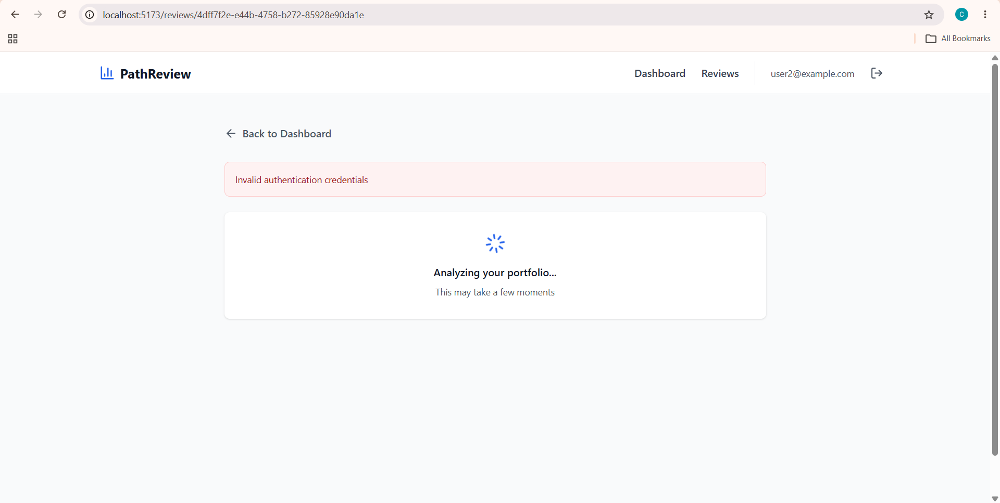

# Reproduction — Issue #101: Add a "Copy link" button to share a public review summary

## Steps to reproduce

1. Logged in and opened an existing review at `/reviews/{review_id}`
2. Clicked the "Share" button on the review page
3. Confirmed a link was copied to the clipboard
4. Opened that copied link in an incognito window (simulating a logged-out visitor)
5. Logged in as a different user to observe behavior

## Observed behavior

The "Share" button already exists in `ReviewPage.tsx` and does copy a link to the clipboard via `handleShare()` — but the link it copies is just `window.location.href`, i.e. the current authenticated page URL (`/reviews/{review_id}`).

When opened in a logged-out session, this link does not resolve to a read-only summary. Instead:

- If not logged in at all, the frontend redirects to login
- If logged in as a _different_ user, the request to `GET /reviews/{review_id}` returns a 404, since that endpoint (`api/routes/reviews.py`) requires `get_current_user` and filters results by `user_id=current_user.id`

There is no public, token-based route anywhere in `reviews.py`, and no expiration logic anywhere in the codebase. So the "Share" feature currently only works for the original owner while logged in — it does not achieve the goal of the issue (a shareable, read-only, no-login link that expires after 30 days).

## Screenshots

## Root cause

The Share button copies the wrong kind of link — a private, ownership-scoped URL — because no separate public sharing mechanism (token generation + public endpoint) exists yet. This confirms the fix needs new backend infrastructure (a share token + public endpoint) rather than just a frontend tweak.
