# Issue #128 — Context and Diagram Reference

Running reference for **AI201 Module 3, Week 7** work on PathReview issue [#128](https://github.com/ascherj/pathreview/issues/128): *Add a dependency vulnerability scan to the CI pipeline*.

This document consolidates Mermaid diagrams and decision notes from issue-selection discussions (GPT/Copilot dialogues, lecture slides, and repo exploration) so you can recall context quickly while implementing the fix.

---

## Issue at a glance

| Field | Value |
|---|---|
| **Number** | #128 |
| **Title** | Add a dependency vulnerability scan to the CI pipeline |
| **Tier** | Tier 3 |
| **Labels** | `tier-3`, `bug`, `devops` |
| **Primary file** | `.github/workflows/ci.yml` |
| **Estimated effort** | 3–5 hours |
| **Proposed branch** | `chore/128-add-dependency-vulnerability-scans` |

### Problem (from issue tracker)

The project has no automated check for known security vulnerabilities in its Python or JavaScript dependencies. The fix should run `pip audit` and `npm audit` and **fail the build on high-severity findings**.

### Why this issue was chosen

Primary learning goal: **CI / DevOps** — edit GitHub Actions YAML directly, configure audit tools, handle exit codes, and iterate through the CI feedback loop.

Trade-offs acknowledged in selection discussions:

- **Pros:** clearest opportunity to learn GitHub Actions workflow structure; explicit scope in one file; real security gate.
- **Cons:** Tier 3 (no extra credit for harder issues); existing dependencies may already have advisories; audit tool behavior differs between Python and npm; policy decisions (severity thresholds, blocking vs. reporting) require investigation.

Alternative CI-learning issues considered: #37 (snapshot tests), #159 (structlog/caplog), #57 (mock GitHub API for integration tests), #129 (migration validation in CI).

---

## Module 3 placement

Week 7 is issue selection and setup. Weeks 8–10 cover reproduction/planning, implementation/PR, and iteration/reflection.

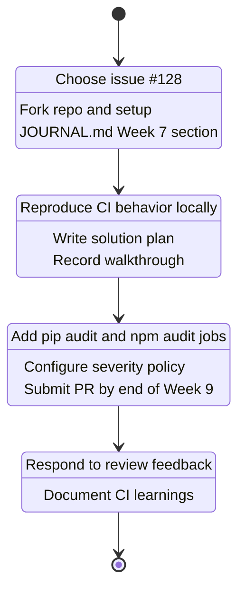

---

## Week 7 homework workflow

Deliverables for this week: fork, setup, claim issue, cohort ledger, branch, `JOURNAL.md`, submit branch URL.

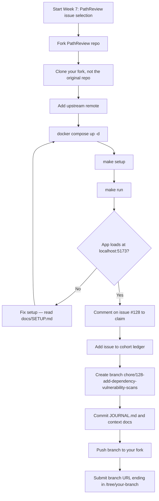

---

## How #128 was selected (CI-oriented decision path)

Issue labels are **faceted** (tier, subsystem, work type overlap). Use a flowchart for decisions, not `gitGraph` — categories are not Git branches.

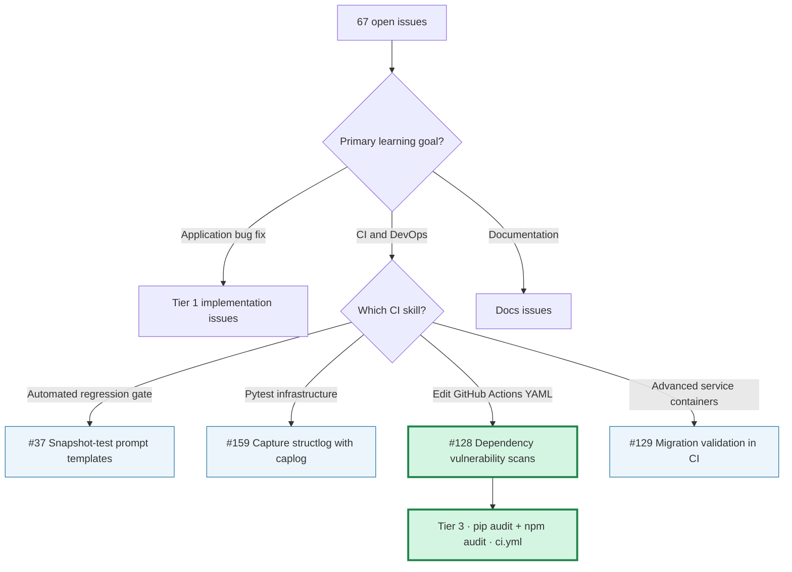

### Issue landscape (quantitative overview)

Sankey diagrams show **volume** across classification dimensions. They are useful for “where are most issues?” but not for strict taxonomy (one issue can have multiple labels).

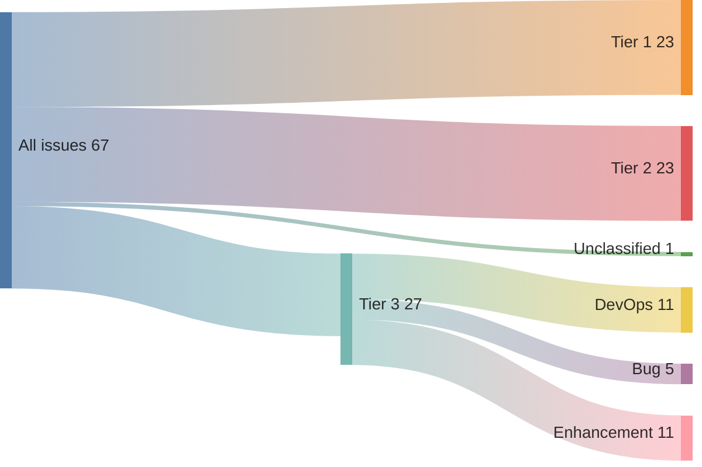

---

## Local setup before touching CI

Step Zero from the Issue Selection lecture: confirm baseline before implementing.

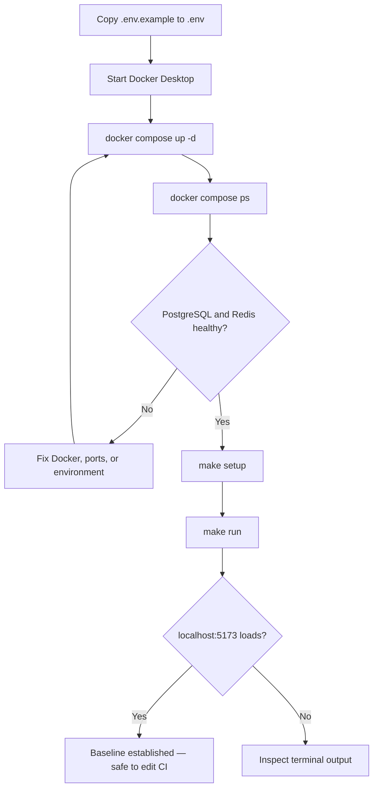

### Make vs GitHub Actions (two layers)

PathReview uses **Make locally** and **explicit tool commands in GitHub Actions**. They are related but not identical.

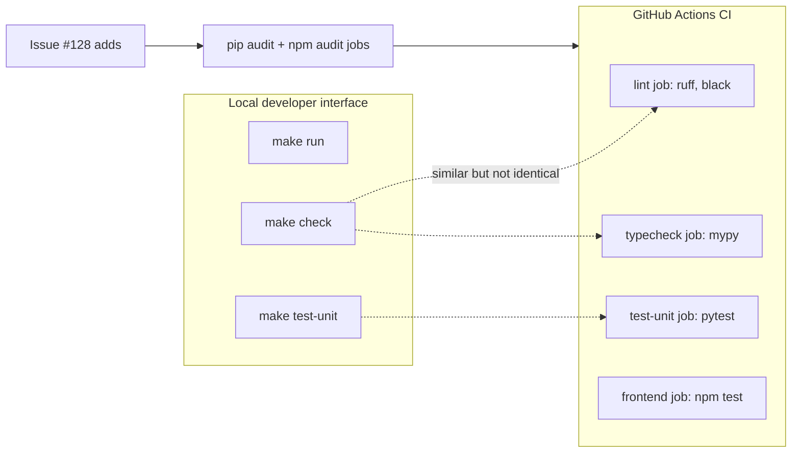

`make check` runs `black .` (modifies files); CI runs `black --check`. For #128, the change target is `.github/workflows/ci.yml`, not the Makefile — though a future `make audit` target could mirror CI locally if maintainers accept that scope.

---

## Current CI structure (before #128)

Existing jobs in `.github/workflows/ci.yml`:

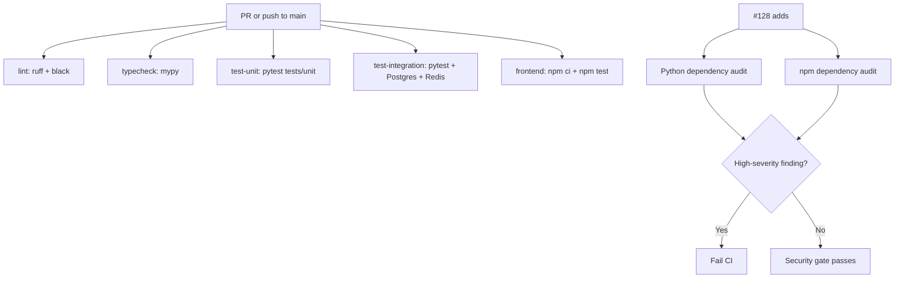

---

## Target CI design for #128

What the new pipeline should do conceptually:

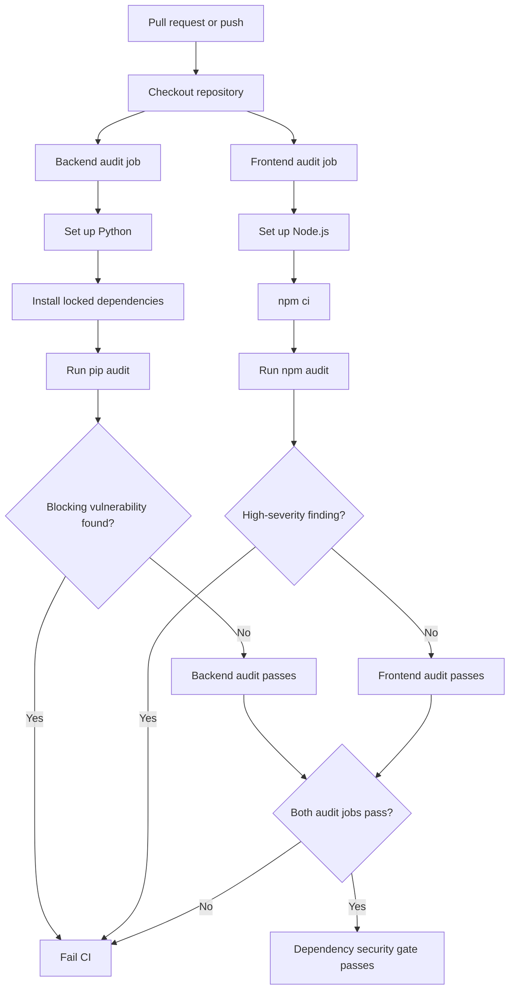

### Design questions to resolve (known unknowns)

1. Which Python audit tool and version will CI install (`pip audit` requires pip ≥ 22.2)?
2. Which dependency files does the auditor inspect (`pyproject.toml`, lockfile)?
3. Should audits be **separate jobs** or **steps in existing jobs**?
4. Does “high-severity” for npm include **critical**, or only `high`?
5. How will moderate/low findings be reported without blocking?
6. What if existing dependencies already have high-severity advisories?
7. Should contributors be able to reproduce audits locally (`make audit` or documented commands)?

---

## Implementation roadmap (`gitGraph`)

`gitGraph` is appropriate here because it models **real branch and commit history**, not issue taxonomy.

### Simple contribution path

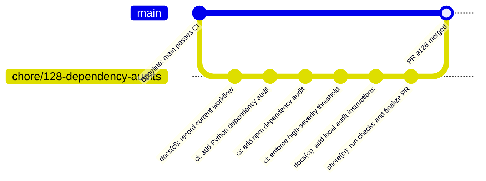

### Realistic CI-learning path (configure → push → diagnose → correct)

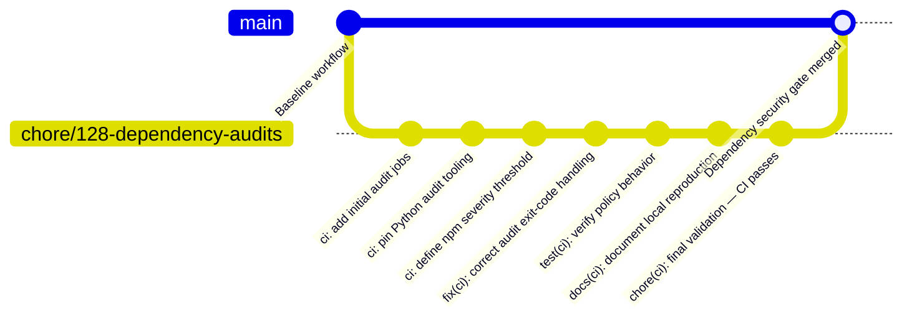

DevOps loop this encodes:

```text
configure → push → observe CI → diagnose → correct → rerun
```

---

## Engineering phases

| Phase | Actions |
|---|---|
| **1. Baseline** | `git checkout main && git pull upstream main`; run `make check && make test-unit`; inspect current GitHub Actions results |
| **2. Audit policy** | Decide severity thresholds, job structure, handling of pre-existing advisories |
| **3. Python scan** | Install deps → run `pip audit` → fail on agreed policy |
| **4. JavaScript scan** | `npm ci` → `npm audit` with agreed threshold |
| **5. Test outcomes** | Verify clean pass, high-severity fail, and unaffected lint/test jobs |
| **6. Document** | Local reproduction commands; update `JOURNAL.md` / solution plan |

---

## Lecture concepts still relevant

### Five questions before committing to an issue

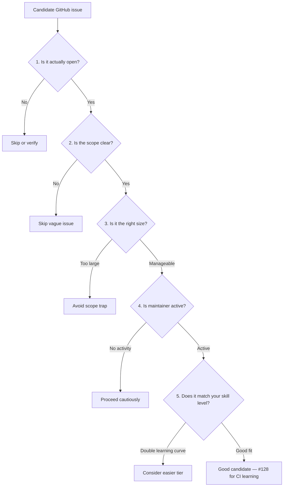

For #128: open ✓, scope clear ✓, size is Tier 3 (larger than Tier 1) ⚠, maintainer active ✓, matches CI-learning goal ✓.

### Solution plan structure (for Week 7–8)

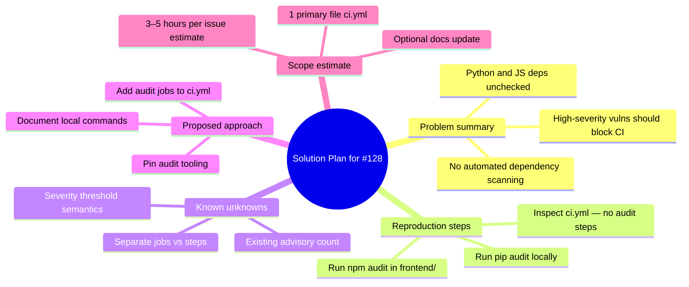

---

## Diagram type cheat sheet

| Diagram | Use for #128 | Avoid for |
|---|---|---|
| **Flowchart** | CI design, setup, issue selection | Git commit chronology |
| **gitGraph** | Branch/commit roadmap, PR lifecycle | Issue category taxonomy |
| **Sankey** | Issue volume by tier/label | Mutually exclusive classification |
| **Mind map** | Solution plan, known unknowns | Request sequence order |
| **stateDiagram** | Module 3 week progression | CI job internals |

---

## Quick command reference

```bash
# Local baseline
docker compose up -d
make setup
make run                    # → localhost:5173

# Pre-PR checks (contribution guide)
make check && make test-unit

# Explore audits locally (before CI integration)
pip install -e ".[dev]"
pip audit
cd frontend && npm ci && npm audit

# Issue data collection (issues live on GitHub, not in git clone)
gh issue view 128 -R jamjamgobambam/pathreview --comments
```

---

## Source discussions

- Issue selection and CI ranking: `docs/dialogue-dlg-m365-f46f6beb-6turns.json`
- Lecture workflows and PathReview architecture: prior Module 3 Lesson 7 dialogue
- Week 7 deliverables: course `projects.txt` and `docs/cursor_project_submission_requirements.md`
- Architecture diagrams in repo root `README.md`

---

*Last updated: Week 7, Module 3 — issue selection phase.*
