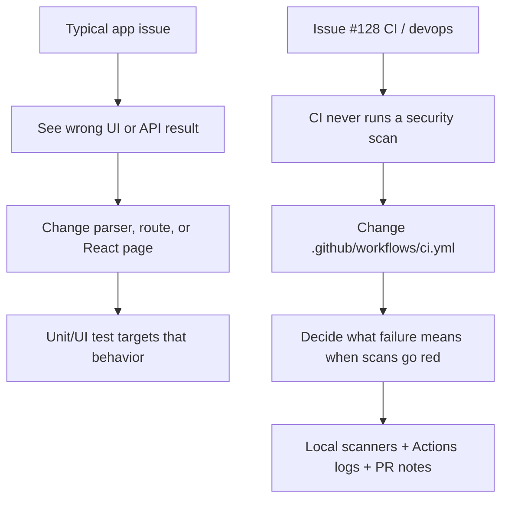
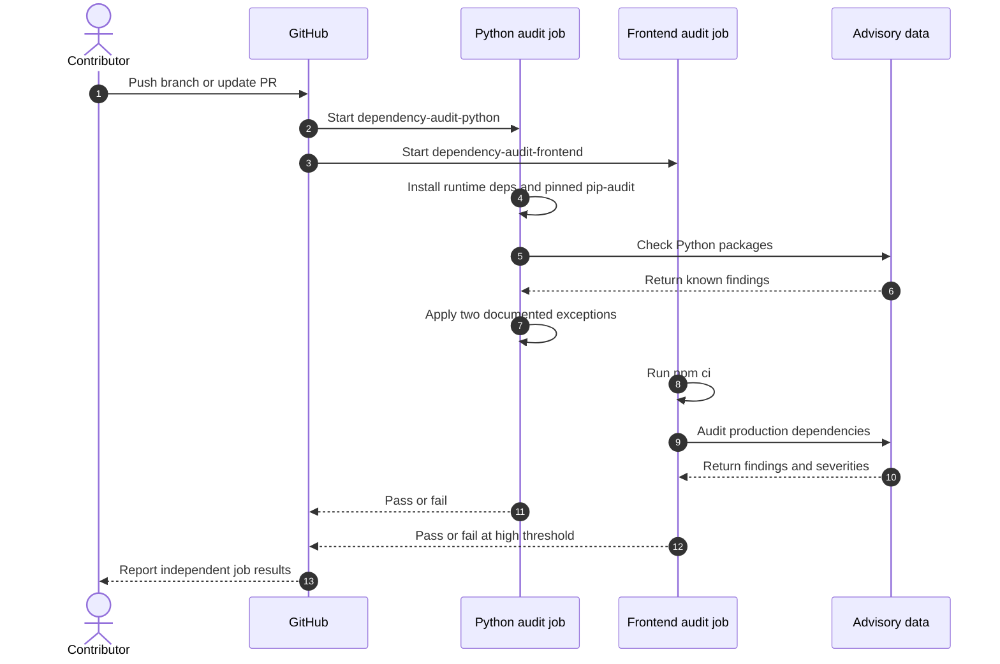
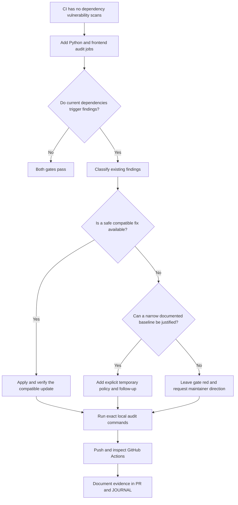
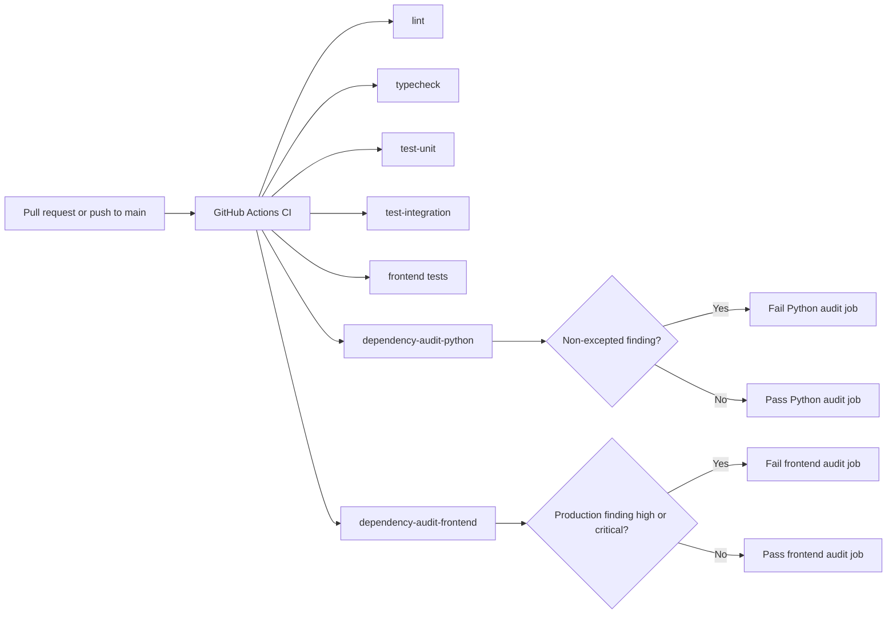
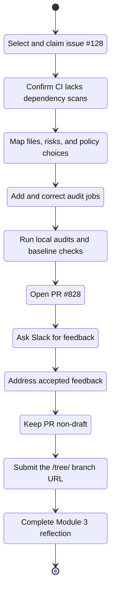
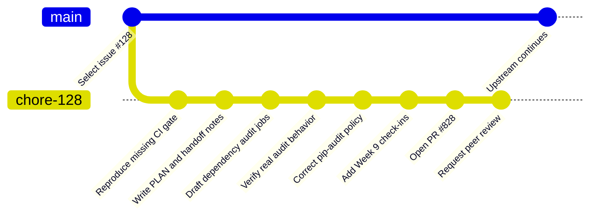
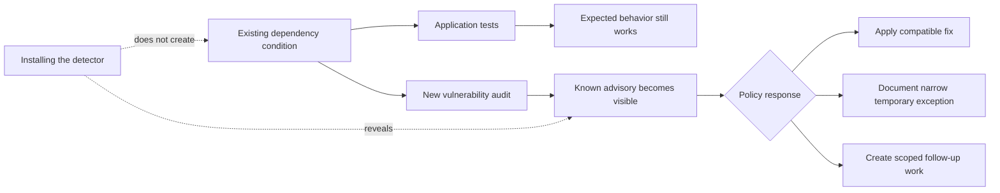

# PathReview Module 3: Issue #128 tour, review request, and CI diagrams

## Purpose

This document provides:

- Slack-ready peer-review requests for [PathReview PR #828](https://github.com/ascherj/pathreview/pull/828)
- A five-level tour of the Module 3 contribution
- Why #128 feels more abstract than many application issues (and how the repo classifies it)
- A beginner-friendly, Head First style explanation of Issue #128
- Mermaid diagrams as fenced text so GitHub can render them (no PNG/base64)
- A Week 9 submission checklist
- A short pastable prompt if you want Copilot to revise this tour further

Related verified references (authoritative over this tour when they disagree):

- [`PLAN.md`](../PLAN.md)
- [`JOURNAL.md`](../JOURNAL.md)
- [`.github/workflows/ci.yml`](../.github/workflows/ci.yml)
- [`docs/issue-128-context.md`](issue-128-context.md)
- [`docs/reproduction-128.md`](reproduction-128.md)
- [`docs/PR_BODY_128.md`](PR_BODY_128.md)

## Project links

- **Issue:** [#128, Add a dependency vulnerability scan to the CI pipeline](https://github.com/ascherj/pathreview/issues/128)
- **Pull request:** [#828](https://github.com/ascherj/pathreview/pull/828) (open / ready for review; not a Draft PR)
- **Working branch:** `chore/128-add-dependency-vulnerability-scans`
- **Course submission branch URL:** https://github.com/speculaas/pathreview/tree/chore/128-add-dependency-vulnerability-scans

### Verified facts (checked against the working tree)

| Claim | Verified value |
|---|---|
| Python scanner | `pip-audit==2.10.1` (not `pip audit`) |
| Python install in CI | `pip install -e .` (runtime; not `.[dev]`) |
| Temporary ignores | `PYSEC-2026-311`, `PYSEC-2026-1325` |
| Frontend gate | `npm audit --omit=dev --audit-level=high` |
| Local gate results | both commands exited 0 (`_audit_scratch/option-e-verified.txt`) |
| JOURNAL Check-in 2 | contains PR #828 link (commit `83fb727` on branch) |

---

# Slack peer-review request

## Recommended version

> Hi everyone! I opened a PR for issue #128 to add automated Python and frontend dependency vulnerability checks to GitHub Actions: https://github.com/ascherj/pathreview/pull/828
>
> The new CI jobs use `pip-audit` for Python and `npm audit` for production frontend dependencies. I also documented two current Python advisories that do not have fixes available. If anyone has a few minutes, I would really appreciate a review, especially from someone familiar with GitHub Actions or dependency security.

## More technical version

> Hi everyone, I would appreciate a peer review on PR #828 for issue #128: https://github.com/ascherj/pathreview/pull/828
>
> This PR adds separate blocking dependency-audit jobs for Python and frontend packages. Local verification passes with `pip-audit==2.10.1` plus two documented no-fix exceptions, and `npm audit --omit=dev --audit-level=high` passes with moderate production findings remaining. My main review question is whether the production-only frontend gate and temporary Python exception policy are clear and appropriately scoped.

## Short version

> Hi everyone, I opened PR #828 for issue #128, which adds Python and frontend dependency vulnerability scans to PathReview CI: https://github.com/ascherj/pathreview/pull/828. I would appreciate a review when anyone has a few minutes, especially feedback on the CI policy and documented exceptions.

After receiving feedback, record the reviewer name or Slack handle in the Week 9 journal entry.

---

# Is #128 “more abstract” than other issues?

**Short answer: yes, relative to app/UI bugs — by design.** That does not make it fake work; it means the *symptom lives in the evaluation process*, not in what a user sees at `localhost:5173`.

## How PathReview’s own docs classify work

The [README “Routing by Issue Label”](../README.md) diagram sorts issues by *symptom*, then points you at directories:

| Symptom class | Typical start | What “broken” looks like |
|---|---|---|
| Parser / chunking / retrieval / API / DB / frontend | Application code under `ingestion/`, `rag/`, `api/`, `frontend/` | User-visible wrong result, crash, bad UX |
| **CI / lint / typecheck / test failure** | `.github/workflows/ci.yml`, `Makefile`, tooling | Pipeline wrong, missing, or failing incorrectly |

Issue #128 was labeled **Tier 3 · `bug` · `devops`**, primary file `.github/workflows/ci.yml` ([`docs/issue-128-context.md`](issue-128-context.md)). The “bug” label is a bit awkward here: the *application* was never broken in the UI sense. The bug is a **missing security gate** — CI never asked the vulnerability question.

Selection notes in that same context doc also contrast learning goals:

- Alternatives closer to “pytest/CI orthodoxy but still grounded”: `#37` snapshot tests, `#159` structlog/`caplog`, `#129` migration validation in CI
- `#128` chosen specifically to **edit GitHub Actions YAML**, interpret scanner exit codes, and make **policy** decisions when existing deps already fail a new gate

So #128 is more abstract than “the form shows the wrong error,” but *less* abstract than a vague “improve security” wishlist: the deliverable is still a concrete YAML job graph plus documented policy.

## What that felt like in practice



The hard part is usually **policy and ecosystems** (`pip-audit` vs `npm audit`, prod vs dev deps, temporary ignores), not writing React/FastAPI code.

---

# Five-level tour of Module 3

## Level 1: One sentence

I contributed a real improvement to an existing project by adding automatic security checks to its GitHub pull-request workflow.

## Level 2: Product view

PathReview is an AI-powered portfolio review application with a React frontend, Python backend, ingestion pipeline, AI and retrieval components, safety features, databases, tests, and GitHub Actions automation.

My change does not alter what an application user sees. It improves the process used to evaluate proposed code changes.

Before Issue #128, GitHub checked formatting, types, tests, and frontend behavior. It did not automatically check whether installed third-party packages had published security advisories.

## Level 3: Problem and solution

Issue #128 asks the project to scan Python and JavaScript dependencies for known vulnerabilities whenever CI runs.

The solution adds two independent GitHub Actions jobs:

1. `dependency-audit-python`
2. `dependency-audit-frontend`

The Python job installs **runtime** project dependencies (`pip install -e .`) and a pinned `pip-audit` scanner. The frontend job installs the lockfile with `npm ci` and audits **production** dependencies at the high-severity threshold (`--omit=dev --audit-level=high`).

## Level 4: Policy

Adding a scanner exposed vulnerabilities that already existed in the dependency tree. The scanner did not create them.

The chosen policy establishes a practical baseline:

- Python findings fail the audit by default.
- Two existing Python advisories without listed fixes receive narrow, documented temporary exceptions (`PYSEC-2026-311`, `PYSEC-2026-1325`).
- Frontend production dependencies fail the job on high or critical findings.
- Moderate findings remain visible without blocking this gate.
- Development-tool migrations, including breaking Vite upgrades, remain separate follow-up work.
- The workflow does not use `continue-on-error`, `|| true`, or a forced npm upgrade.

## Level 5: Engineering and contribution lifecycle

The deeper engineering concerns are:

- **Reproducibility:** CI must explicitly install every required tool.
- **Policy:** A scanner needs clear rules for which findings block a pull request.
- **Scope:** A focused CI contribution should not become an unrelated frontend migration.
- **Observability:** Separate jobs show whether Python or frontend auditing failed.
- **Evidence:** Local commands, GitHub Actions, journal entries, and the PR description should agree.
- **Contribution practice:** The work moves from issue selection through planning, implementation, review, submission, and reflection.

---

# Head First style explanation

## Meet Pat, the CI robot

Pat works for PathReview. Every time someone opens a pull request, Pat asks:

- Is the code formatted?
- Do the types make sense?
- Do the tests pass?
- Does the frontend still work?

Pat had one missing question:

> Do any of the third-party package versions have published security vulnerabilities?

## Working software can still use a vulnerable package

A normal test might say:

```text
The dependency performs the expected function: PASS
```

A security audit might say:

```text
This dependency version has a published advisory: FAIL
```

These results do not contradict each other. A package can behave correctly in tests while still having a known weakness under particular conditions.

## Your PR gives Pat two new checklists

### Python checklist

```text
[ ] Set up Python
[ ] Install runtime project dependencies (pip install -e .)
[ ] Install the pinned pip-audit scanner (2.10.1)
[ ] Check installed packages against advisory data
[ ] Apply only the documented temporary exceptions
[ ] Fail when the policy is violated
```

### Frontend checklist

```text
[ ] Set up Node
[ ] Reproduce package-lock.json with npm ci
[ ] Audit production dependencies (--omit=dev)
[ ] Fail on high or critical findings (--audit-level=high)
```

## Installing a smoke detector does not create smoke

When the audits first ran, they reported existing findings. The new CI jobs did not add those vulnerabilities. They made an existing condition visible.

A useful security gate must answer a difficult transition question:

> What should happen when a repository already violates the policy that a new scanner is meant to enforce?

The selected approach avoids both extremes. It does not disable the scanner, and it does not force a breaking frontend migration into a focused CI pull request.

## Why `pip audit` was wrong

Upgrading `pip` does not create a built-in `pip audit` command in this environment. The scanner is a separate package named `pip-audit`.

Conceptually:

```bash
python -m pip install "pip-audit==2.10.1"
pip-audit
```

Pinning the scanner version makes the tested tool version explicit and repeatable.

## Why the npm command is specific

```bash
npm audit --omit=dev --audit-level=high
```

- `npm audit` checks packages against known advisories.
- `--omit=dev` focuses this blocking gate on production dependencies.
- `--audit-level=high` returns a failure for high or critical findings.

This is a policy boundary, not a claim that development dependencies are unimportant. Development-tool findings can be tracked and remediated separately without forcing a breaking upgrade into this PR.

## The main lesson

The YAML is only part of the work. CI engineering also requires decisions about:

- what should block a pull request
- how ecosystems express severity differently
- how to handle pre-existing findings
- how narrow exceptions remain visible and temporary
- how to keep a contribution within scope
- how to document evidence honestly

---

# Mermaid diagrams

GitHub should render the following Mermaid blocks directly from this Markdown file.

## 1. Pull request security-check sequence



## 2. Issue #128 decision flow



## 3. CI job structure



## 4. Module 3 contribution lifecycle



## 5. Git graph as a learning metaphor

> **Caveat:** This `gitGraph` is an explanatory metaphor for the learning path. It is not guaranteed to reproduce the repository's exact commit history or hashes. Use `git log` when exact history matters.



## 6. The smoke-detector metaphor



### Mermaid validation notes (Cursor)

- Six fenced `mermaid` blocks; no PNG/base64.
- `gitGraph` uses branch name `chore-128` (no `/`) to reduce parser risk; real branch is `chore/128-add-dependency-vulnerability-scans`.
- Sequence/flowchart/stateDiagram syntax looks GitHub-compatible; final check is GitHub’s renderer on the PR/commit view.
- New classification flowchart above uses only simple node labels (no Markdown links inside nodes).

---

# Week 9 final checklist

- [x] Confirm Check-in 2 contains PR #828 (in `JOURNAL.md` on this branch).
- [ ] Confirm the latest `JOURNAL.md` / tour commits are **pushed** to `origin` (re-check after this docs commit).
- [x] Confirm PR #828 is open and ready for review, not marked Draft.
- [ ] Confirm the live PR description contains only reviewer-facing content (strip any leftover “how to create PR” instructions if still present).
- [ ] Inspect `dependency-audit-python` in GitHub Actions.
- [ ] Inspect `dependency-audit-frontend` in GitHub Actions.
- [ ] Post one Slack review request.
- [ ] Record reviewer feedback or `none` truthfully in `JOURNAL.md`.
- [x] Document `make check` / `make test-unit` relative to the known pre-existing baseline (see Check-in 2).
- [ ] Submit the working branch URL, not a bare repository URL.

---

# Prompt for Copilot: tighten this tour (optional)

Paste this into M365 Copilot if you want a revised pass. Prefer a short reply Cursor can merge, not a full re-download.

```text
You wrote docs/module-3-issue-128-tour.md for PathReview #128 / PR #828.

Critique and propose a SHORT patch outline (not a whole new file unless necessary):

1. Abstractness: We added a section comparing app-issue symptoms vs CI/devops routing from README “Routing by Issue Label” and docs/issue-128-context.md (Tier 3, devops, ci.yml). Improve that explanation for a classmate who only knows frontend bugs. Add one concrete “if this were Tier 1 UI…” contrast.

2. Accuracy guardrails: Never reintroduce `pip audit` as the CI command. Keep pip-audit==2.10.1, ignore PYSEC-2026-311 and PYSEC-2026-1325, npm audit --omit=dev --audit-level=high, runtime `pip install -e .`.

3. Diagrams: Keep fenced Mermaid only. Flag any GitHub Mermaid gotchas (quoted labels, reserved words, too-wide LR charts). Suggest at most one NEW diagram if it clarifies “bug label vs missing security gate.”

4. Audiences: Mark which sections are for Slack peers vs grader/self vs Week 10 reflection so the doc is less “everything in one pile.”

5. Do not invent Actions results, push state, or peer-review names. Leave unknowns as checklist items.

Return: (A) bullet critique, (B) suggested section headings, (C) any Mermaid snippet that needs a fix.
```

---

# Scope note

This document is explanatory course and reviewer support material. It should not replace the pull-request description, the verified CI workflow, `PLAN.md`, or the required Week 9 journal entries.
